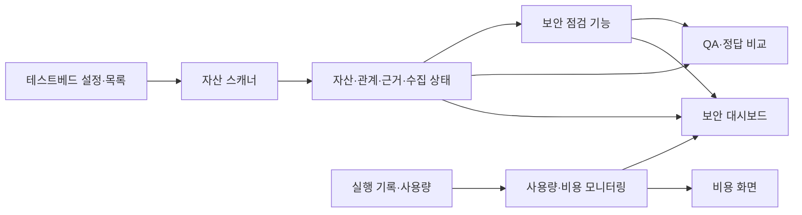

# Agent Scope 전체 프로젝트 기획서

> 과제명: 인공지능 에이전트 보안을 위한 자산 식별 및 가시화 기술 개발  
> 작성일: 2026-09-29 · 수정일: 2026-10-01 · 버전: v0.4 · 상태: 팀 검토용 초안  
> 대상: 2026-2학기 파란학기제 Agent Scope 팀

본 문서는 프로젝트의 목적·범위·주요 기능과 개발·검증 방향을 제시한다. 상세 판정 기준은 공격표면 정의서와 위협 시나리오에서, 데이터 형식은 통합 스키마에서, 구현·시험 절차는 파트별 개발 문서와 QA 문서에서 구체화한다.

## 1. 프로젝트 개요

### 1.1 추진 배경 및 필요성

AI Agent가 외부 도구와 데이터를 사용하는 환경에서는 모델뿐 아니라 연결 서버, 도구 정의, 확장 구성요소와 권한을 함께 파악해야 한다. 본 프로젝트는 OpenClaw 테스트베드의 MCP 관련 구성을 대상으로, 보안 점검의 기초가 되는 자산 목록과 연결 관계를 확보하고 이를 탐색할 수 있는 도구를 개발한다.

### 1.2 문제 정의

설정 파일, 서버 목록, 도구 정의, Skill·Plugin 정보가 분산되어 있으면 환경 전체의 연결 관계를 파악하기 어렵다. 자산 이름만으로는 소속 서버, 공급 출처, 권한 범위와 점검 근거를 구분하기 어렵고, 수집 실패를 자산 부재로 오해할 수도 있다.

설정상 접근 가능성과 실제 실행 사실도 다르다. 사용량이 관측되더라도 개별 도구에 정확하게 귀속되지 않을 수 있으므로, 확인된 사실·추정·미확인을 구분하여 표시해야 한다.

### 1.3 프로젝트 목표

**Agent Scope는 OpenClaw 환경의 MCP 중심 자산을 수집하고, 자산 간 관계·권한·위험 근거와 확보 가능한 사용량 정보를 함께 확인하는 도구이다.**

1. 7종 자산과 관계를 일관된 식별자로 수집한다.
2. 자산의 출처·권한·노출 상태와 판단 근거를 확인할 수 있게 한다.
3. 그래프와 목록을 연결하여 관련 자산과 잠재 영향 경로를 탐색하게 한다.
4. S1~S5 시나리오의 합의된 위험 조건을 정상 조건과 비교하여 검증한다.
5. 관측 가능한 도구 실행·사용량과 근사 비용을 표시하고, 자산 연결 여부와 추정 여부를 구분한다.
6. 동일한 테스트베드와 기준 데이터로 결과를 재현할 수 있게 한다.

### 1.4 개발 범위

| 영역 | 개발할 기능 |
|---|---|
| 자산 식별 | Gateway, Node, MCP Server, Tool, Resource/Prompt, Skill, Plugin 수집 |
| 관계·공격표면 분석 | 선언·광고·연관 관계, 근거가 있는 잠재 노출·접근 관계와 정적 위험 조건 분석 |
| 런타임 관측 | 확보 가능한 실행 스팬, 호출 패턴·실행 시간, 토큰·비용 근사 귀속 |
| 테스트베드 | 정상·위험 구성, 기준 스냅샷, 정답 데이터와 초기화 절차 |
| 대시보드 | 자산 목록·상세·관계 그래프, 점검 근거·수집 상태·사용량 연계 |
| 검증·통합 | 공통 계약 검증, 시나리오 비교, 결함 수정·재검증과 모듈 연동 |

7종은 지원할 분류 체계이며, 실제 환경에 없는 자산을 가상 데이터로 채워 수집 성공으로 집계하지 않는다. 상세 필드의 지원 범위는 실제 수집 예제로 확인한다.

## 2. 프로젝트 핵심 개념 및 분석 범위

### 2.1 AI Agent 및 MCP 구조

본 프로젝트에서는 AI Agent를 모델의 판단과 외부 기능 실행을 연결하는 분석 대상으로 본다. MCP Host·Client·Server는 외부 기능과 데이터를 연결하는 구조를 설명하는 개념이며, OpenClaw의 Gateway·Node는 실제 설정과 수집 위치를 구분하는 제품 구성요소로 다룬다. 두 분류를 근거 없이 일대일로 대응시키지 않는다.

MCP Server가 제공하는 Tool·Resource·Prompt의 목록과 정의를 수집하여 연결 구조를 파악한다. 서버가 기능을 광고한다는 사실은 그 기능이 안전하거나 실제로 호출 가능하다는 증거가 아니다.

### 2.2 보안 자산 정의

보안 자산은 에이전트의 기능·연결·권한과 보안 영향을 설명하기 위해 식별하는 구성요소이다. 직접 수집 자산은 다음 7종으로 한정한다.

| 자산 유형 | 식별할 내용 |
|---|---|
| Gateway | 게이트웨이 설정과 서버 선언의 주체 |
| Node | 노드 설정과 노드 측 서버·스킬의 소유 주체 |
| MCP Server | 선언 위치, 연결 방식, 서버 식별 정보 |
| Tool | 소속 서버와 공식 이름, 설명·입력 스키마 |
| Resource/Prompt | 서버가 제공하는 자원·프롬프트 정의 |
| Skill | 설치·선언 위치, 출처·버전, 연관 기능 |
| Plugin | manifest·설정, 출처·버전, 등록·연관 구성요소 |

MCP Resource는 서버가 제공하는 자원 정의이고, Backend Resource는 잠재적으로 접근하는 파일·DB·API 등이며, External Destination은 잠재 전송 목적지이다. Agent·Backend Resource·External Destination은 관계의 참조 대상으로 표현하고 7종 직접 수집 자산 수와 구분한다.

### 2.3 공격표면 정의

본 프로젝트에서 공격표면은 **MCP 통신 경계를 중심으로 비신뢰 주체가 입력·변조하거나 악용할 수 있고, 현재 구성과 정책상 도달 가능한 인터페이스·기능·잠재 데이터 흐름**으로 정의한다. 발견된 모든 자산을 활성 공격표면으로 간주하지 않는다.

| 판정 요소 | 확인할 질문 |
|---|---|
| 신뢰 경계 | 서로 다른 신뢰 수준의 주체·구성요소 사이로 정보나 명령이 이동하는가? |
| 통제 가능성 | 외부 서버·공급자 등 비신뢰 주체가 입력이나 정의를 변경할 수 있는가? |
| 도달 가능성 | 현재 연결·활성화·필터·승인 정책에서 해당 기능에 도달할 수 있는가? |
| 보안 영향 | 악용 시 정보 접근·전송, 명령 실행 또는 권한 오용에 영향을 줄 수 있는가? |

판정 근거가 부족하면 안전 또는 비활성으로 단정하지 않고 미확인 상태와 필요한 근거를 남긴다.

### 2.4 핵심 공격표면과 분석 축

| 구분 | 프로젝트 내 역할 | 분석 내용 |
|---|---|---|
| A. MCP 통신 경계 | 핵심 공격표면 | Client–Server 연결, 외부 정의·입력, Tool·Resource·Prompt 제공 관계 |
| B. Skill·Plugin 공급망 | 자산 분석 축 | 출처·공급자·버전·무결성, 서버·도구 추가 또는 변경과의 연관 |
| C. 권한·자격증명 | 자산 분석 축 | 인증 참조, scope·audience, 파일·네트워크·실행 권한과 승인 정책 |

B·C는 독립적인 전체 공급망 보안 제품이나 권한 관리 시스템으로 확장하지 않고, MCP 자산의 신뢰도와 잠재 피해 범위를 설명하는 데 활용한다.

### 2.5 자산 상태 모델

| 상태 | 의미 | 판정 근거와 한계 |
|---|---|---|
| `DECLARED` | 설정에 선언됨 | 해당 설정·등록 정보 |
| `DISCOVERED` | 파일 또는 목록 응답에서 발견됨 | 설치 파일·서버 목록 응답 |
| `EXPOSED` | 특정 Agent/Host에 표시되거나 연결됨 | 대상과 유효 정책을 확인할 수 있을 때 판정 |
| `POTENTIALLY_CALLABLE` | 정적 조건상 호출 가능성이 있음 | 연결·정책·권한 조건의 조합에 따른 추론 |
| `CALLABLE` | 실제 호출 가능함 | 해당 실행 맥락의 런타임 검증 필요 |
| `USED` | 실행 기록에서 사용이 관찰됨 | 자산과 연결되는 실행 근거 필요. 성공 여부는 별도 기록 |

상태는 하나의 단계 값으로 덮어쓰지 않고 근거·시각·대상 맥락과 함께 관리한다. 미확인은 false와 구분한다. Tool 목록 수집 성공이나 필터 이름 일치만으로 `EXPOSED`·`CALLABLE`을 확정하지 않으며, 정적 스캐너는 `CALLABLE`·`USED`를 확정하지 않는다.

### 2.6 분석 범위 및 제외 범위

현재 분석은 구성·목록·정의의 스냅샷과 확보 가능한 실행 텔레메트리를 대상으로 한다. 정적 분석은 잠재 노출·접근·전송 경로를 설명하고, 런타임 관측은 실제로 확보한 실행·사용량 근거만 추가한다. 두 결과를 연결해도 관측하지 않은 행위까지 발생한 것으로 판정하지 않는다.

다음 항목은 이번 MVP에서 제외하거나 후속 확장으로 둔다.

- 실제 도구 실행·파일 접근·외부 전송 전체를 추적하는 런타임 보안 시스템
- 공격 성공·정보 유출·중간자 공격의 실증 및 공격 자동 차단·권한 자동 수정
- 프롬프트 인젝션 탐지 모델 개발, 모든 에이전트 프레임워크 지원
- 반복 호출·차단 이벤트 기반 보안 탐지와 CPU·메모리 등 추가 자원 관측
- 근거 없는 도구별 정확한 비용·종합 위험 점수

스냅샷 변경 비교, 사용량 연결 정확도 개선, 자동 갱신·그래프 탐색 편의 기능은 기본 연동 이후 범위를 협의한다. 단순 스냅샷 차이를 지속적 런타임 공격 탐지와 동일하게 취급하지 않는다.

## 3. 시스템 개발 기획

### 3.1 전체 시스템 구성

위 도식은 논리적 기능 구분이다. 실제 서비스와 모듈의 배치는 구현 구조에 맞춰 정한다.

| 모듈 | 입력 | 출력 및 책임 |
|---|---|---|
| 테스트베드 | 환경 구성·시나리오 요구사항 | 환경 ID 기준, 버전, 초기화 방법, 기준 구성 |
| 스캐너 | 설정·manifest·허용된 목록 조회 결과 | 자산 ID, 자산·관계·근거, 대상별 수집 상태 |
| 보안 점검 기능 | 자산 스냅샷·합의된 점검 규칙 | 관련 자산·규칙·근거가 연결된 정적 경고 |
| 사용량·비용 모니터링 | 확보 가능한 로그·사용량 기록 | 관측 단위별 사용량·비용, 자산 연결 정보와 추정 방식 |
| 대시보드 | 스냅샷·점검 결과·사용량 | 자산·관계·근거 탐색, 상태·한계 표시 |
| QA | 기준 환경·정답 목록·각 모듈 출력 | 합격 판정, 측정 결과, 결함 및 재검증 기록 |

모듈은 공통 자산 식별 정보로 연결하며, 정적 분석과 실행 관측 결과가 동일한 환경과 자산을 가리키도록 구성한다. 세부 기술 선택과 인터페이스는 각 모듈의 설계에서 구체화한다.

### 3.2 자산 식별 및 관계 수집

스캐너는 설정·manifest·허용된 목록 조회 결과를 입력받아 자산, 관계, 근거, 수집 상태를 스냅샷으로 제공한다. 대시보드와 분석 기능은 같은 자산 ID를 사용하고 QA는 이를 정답 데이터와 비교한다.

### 3.3 공격표면 분석

분석 기능은 자산 스냅샷과 승인·권한 기준을 입력받아 신뢰 경계, 도달 가능성, 잠재 영향을 평가한다. 결과에는 관련 자산·규칙·근거를 연결하여 사용자가 경고의 이유를 확인할 수 있게 한다.

### 3.4 런타임 사용·실행 관측

관측 기능은 실행 스팬을 통해 도구 사용과 호출 패턴을 확인하고, 가능한 구간에서 토큰·비용을 근사 귀속한다. 정적 스냅샷과 별도 경로로 수집하며 환경·자산 식별 정보로 연결한다. 사용량 수집 자체를 전체 런타임 보안 탐지 구현으로 간주하지 않는다.

### 3.5 보안 테스트베드

테스트베드는 분산된 선언 위치와 정상·위험 구성을 재현하는 기준 환경이다. 게이트웨이와 노드를 분리한 로컬 VM 2대를 사용하고, 수집·분석·가시화가 동일한 구성과 버전을 기준으로 동작하도록 한다.

### 3.6 보안 가시화 대시보드

대시보드는 운영자·보안 점검자가 환경 요약에서 자산, 관계, 위험 근거와 사용량으로 이동하는 탐색 화면이다. 원본 ID와 판단 근거를 유지하며 정적 위험, 실제 관찰, 추정과 미확인을 구분한다. 사용량 상세는 모니터링 화면을 활용하고 보안 대시보드는 요약과 자산 연결을 중심으로 구성한다.

## 4. 세부 기능 및 개발 방법

### 4.1 자산 식별 스캐너

설정에 선언된 정보와 서버가 제공하는 기능 목록을 함께 수집하여 자산 인벤토리를 구성한다. Gateway·Node에 분산된 설정, MCP 서버의 도구·자원·프롬프트, Skill·Plugin의 출처와 권한 정보를 연결한다.

같은 자산을 반복 수집해도 일관되게 식별하고, 서로 다른 서버의 동명 도구는 구분한다. 자산과 관계에는 수집 근거를 연결하며, 정상적인 빈 결과와 수집 실패를 구별하여 가시화한다. 비밀값은 수집·표시하지 않고 보안 분석에 필요한 참조와 속성만 활용한다.

### 4.2 공격표면 분석 기능

자산의 존재뿐 아니라 신뢰 경계, 비신뢰 주체의 통제 가능성, 정책상 도달 가능성과 잠재 보안 영향을 함께 분석한다. 공급망·권한 속성을 시나리오의 정상 기준과 비교하고, 점검 결과를 관련 자산과 근거에 연결한다.

잠재 접근·전송 관계를 조합하여 영향을 받을 수 있는 경로를 탐색한다. 정적 분석으로 확인한 가능성과 실제 실행 사실을 구분하고, 근거가 부족한 판단은 미확인으로 남긴다. 상세 판정 규칙은 별도 정의에 따른다.

### 4.3 런타임 Telemetry 수집

OpenTelemetry 기반 실행 기록을 활용하여 도구 사용, 호출 패턴, 실행 시간과 토큰 사용량을 관측한다. 정적 자산 정보와 실행 기록을 연결해 구성상 존재하는 자산이 실제로 어떻게 사용되는지 확인할 수 있도록 한다.

사용량은 관측 가능한 단위를 기준으로 제공하고, 도구별 귀속이 가능한 범위에서 근사치를 제시한다. 병렬 실행이나 관측 정보 부족으로 귀속하기 어려운 경우에는 실행 시간·호출 수 등 보조 정보를 활용한다. 비용은 사용량을 이해하기 위한 보조 지표로 제공하며, 추정값과 실제 관측값을 구분한다.

### 4.4 테스트베드 및 위협 시나리오

게이트웨이와 노드를 분리한 테스트 환경에서 단일 구성, 분산 구성, 전체 자산을 포함한 구성을 단계적으로 재현한다. 정상 구성을 기준으로 위험 조건을 변경하고 초기 상태로 복구할 수 있도록 설계한다. 실제 운영 계정·비밀값 대신 테스트용 데이터를 사용한다.

위협 시나리오는 다음 다섯 방향으로 구성하며, S1→S2→S4→S3→S5 순서로 구체화한다.

| ID | 시나리오 | 개발·검증 방향 |
|---|---|---|
| S1 | 비인가 MCP 서버 등록 및 노출 | 승인되지 않은 서버와 등록 주체·노출 관계 확인 |
| S2 | 악성 또는 과도한 권한의 Tool 광고 | 도구 정의·권한·승인 정책에 따른 잠재 위험 분석 |
| S3 | Tool 이름 충돌을 이용한 호출 대상 위장 | 동명 도구의 소속과 권한 차이 식별 |
| S4 | 과도한 자격증명 공유로 인한 피해 범위 확대 | 자격증명 참조와 권한 범위를 통한 잠재 영향 분석 |
| S5 | 보안이 약한 MCP 연결 | 연결 설정과 신뢰 조건에 따른 위험 확인 |

각 시나리오는 정상·위험 구성을 비교하여 정적 위험의 식별과 가시화를 검증한다. 실제 공격 성공을 판정하는 범위로 확대하지 않는다. 환경 사양·재현 절차·탐지 조건·기대 경고는 테스트베드와 시나리오 문서에서 구체화한다.

### 4.5 대시보드 및 관계 그래프

| 기능 | 제공할 정보와 사용자 행동 |
|---|---|
| 환경 요약 | 자산 현황·수집 상태·점검 결과를 확인하고 대상 환경 선택 |
| 자산 목록·상세 | 이름·소속·출처·권한을 탐색하고 판단 근거 확인 |
| 관계 그래프 | 연결 자산과 잠재 영향 경로 탐색 |
| 점검 결과 | 경고에서 관련 자산·관계·근거로 이동 |
| 사용량 연계 | 자산의 실행 현황과 사용량·비용의 관측·추정 범위 확인 |

환경 선택에서 자산·관계 탐색, 위험 근거와 사용량 확인으로 이어지는 흐름을 제공한다. 정적 위험 경고, 실제 실행 기록, 데이터 수집 오류를 구분하여 표시하고, 근거가 없는 상태를 안전한 것으로 오해하지 않도록 한다.

## 5. 검증 계획

### 5.1 검증 환경

정상·위험 구성을 재현할 수 있는 공통 테스트베드에서 검증한다. 실제 구성에 근거한 정답 데이터를 마련하고, 같은 환경과 조건에서 결과를 반복 비교할 수 있도록 버전과 구성 기준을 관리한다.

### 5.2 정상/적대 구성 시나리오

S1~S5 각각에 정상 대조군과 위험 구성을 준비한다. 위험 조건이 추가되었을 때 필요한 자산·관계·경고가 나타나는지와 정상 상태에서 부당한 경고가 발생하지 않는지를 함께 확인한다. 시나리오별 재현·초기화 절차와 기대 결과는 별도 테스트케이스로 관리한다.

### 5.3 자산 식별 검증

정답 데이터와 비교하여 자산의 누락·오탐·중복, 소속 관계와 근거의 정확성을 평가한다. 반복 수집 시 식별 일관성과 분산 환경의 수집 범위를 확인하고, 수집 실패가 자산 삭제나 정상적인 빈 결과로 해석되지 않는지 검증한다.

### 5.4 공격표면 분석 검증

자산 상태와 위험 판단이 수집 근거·정책에 부합하는지 확인한다. 정적으로 추론한 가능성과 실제 관찰을 구분하고, 시나리오의 위험 조건을 식별하면서 정상 대조군의 오탐을 줄이는 방향으로 평가한다. 경고에서 관련 자산과 판정 근거까지 추적할 수 있는지도 검증한다.

### 5.5 런타임 관측 및 가시화 검증

실행 기록·사용량과 자산 정보가 일관되게 연결되는지, 관측값·추정값·연결 불가 상태가 화면에 올바르게 표현되는지 확인한다. 도구별 사용량 귀속의 한계와 비용 추정의 근거를 사용자가 파악할 수 있어야 한다.

평가는 자산·관계의 정확성, 시나리오 위험 식별과 정상 환경 오탐, 사용량 연결 가능성, 화면의 근거 추적 가능성, 처리 성능과 재현성을 중심으로 수행한다. 모듈별 결과뿐 아니라 수집부터 분석·가시화까지 이어지는 전체 흐름을 검증한다. 구체적인 측정식·수치 목표·합격 기준·시험 절차는 QA 문서에서 관리한다.

## 6. 개발 추진 계획

### 6.1 팀원별 역할

| 영역 | 담당 | 주요 역할 |
|---|---|---|
| 테스트베드 | 박병하 | 범위·협업 조정, 환경 구성·초기화·버전 기준 |
| 자산 스캐너 | 김규민 | 수집 범위, 안정 ID, 예제 출력, 수집 오류 처리 |
| 시나리오·대시보드 | 고혜림 | 시나리오 작성·확정 조율, 화면 요구사항, 자산·근거 가시화 |
| 사용량·비용 모니터링 | 이정철 | 관측 단위, 귀속 방식, 비용 기준, 연계 데이터 |
| 공격 표면·QA | 정서진 | 분석 범위 정합성, 정답 데이터, 검증 조건·결함·결과 관리 |

### 6.2 모듈 통합 계획

공통 데이터 예제로 모듈 간 해석을 맞춘 뒤 실제 자산 수집, 정적 점검 결과, 사용량과 대시보드를 순차적으로 연결한다. 동일한 환경·자산 식별 기준을 공유하고, 데이터의 근거와 수집 상태를 전달 과정에서도 유지한다.

정상 결과와 실패·부분 수집 결과를 함께 검증하며, 전체 이용 흐름이 연결되면 위협 시나리오로 통합 동작을 확인한다. 계약 변경 시 관련 모듈과 검증 범위를 함께 검토한다. 필드·식별자·오류 표현·전달 형식은 통합 스키마에서 구체화한다.

### 6.3 목표 산출물

| 구분 | 목표 산출물 | 주요 내용 |
|---|---|---|
| 핵심 | 자산 인벤토리 스캐너 | MCP 중심 자산·관계·근거·수집 상태를 수집하고 일관된 형식으로 제공 |
| 핵심 | 자산 그래프 대시보드 | 자산 목록·관계·권한·점검 근거를 연결하여 탐색 |
| 연계 | 사용량·비용 모니터링 | 관측 가능한 사용량·비용과 자산 연결 정보 제공, 추정 여부 표시 |
| 검증 | 재현 가능한 테스트베드 | 정상·시나리오 구성과 초기화·재실행 환경 제공 |
| 검증 | 위협 시나리오 및 QA 결과 | 정상·위험 조건, 정답 데이터, 테스트 결과·증적과 결함 검증 기록 |

## 7. 기대 효과 및 활용 방안

| 활용 대상 | 기대 효과 | 활용 방식 |
|---|---|---|
| 에이전트 운영자·개발자 | 분산된 서버·도구·확장 구성과 권한 파악 | 자산 목록과 그래프로 설정·소속 관계 점검 |
| 보안 점검 담당자 | 위험 판단의 근거와 잠재 영향 범위 확인 | 시나리오 경고에서 자산·권한·잠재 경로 탐색 |
| 사용량 확인 담당자 | 도구 실행과 근사 토큰·비용의 관계 이해 | 관측값·추정값·귀속 불가를 구분하여 확인 |
| 개발·검증 팀 | 변경 결과와 결함의 재현성 확보 | 기준 환경·정답 데이터로 회귀 검증 |

기대 효과는 자산 식별 정확성, 정상 환경 오탐, 근거 추적 가능성, 사용량 연결 가능성과 재현성으로 평가한다. 기존 제품 대비 우수성이나 공격 탐지 성능은 비교 실험 없이 주장하지 않는다.

후속 발전 방향은 비교 가능한 스냅샷의 변경 분석, 사용량 귀속·자산 연결 개선, 근거가 확보된 런타임 보안 이벤트 연계이다. 타 에이전트 환경으로 확장할 경우 MCP 공통 정보와 제품별 설정 수집을 구분하는 구조를 활용하되, 해당 환경에서 수집·판정 가능성을 새로 검증한다.
