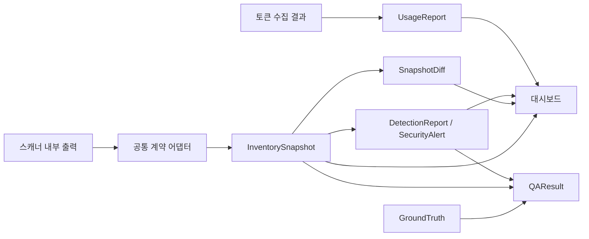

# Agent Scope 전체 데이터 스키마 — PR 통합 검토안

> 작성일: 2026-09-29 · 상태: 팀 협의 전 초안
> 문서 버전: v0.6 · 수정일: 2026-10-02 (KST)
> 공유 상태: 팀 검토용 협의안. 구현 계약 확정 전 검토를 위해 공유한다.
> 검토 기준: 열린 PR #1, #3, #4, #5, #6, #7의 조회 시점 HEAD 및 로컬 v0.5 편집본. PR별 기준 commit과 불일치는 15절 참조.
> 프로젝트 필드·필수 조건·허용값은 모두 제안이며 합의 완료를 뜻하지 않는다. 11~16절에 생산자·소비자 매핑과 결정 사항을 정리한다.
> 데이터 계약 버전: `0.6.0-draft` · 신규 연계 계약을 포함한 제안 버전. 기존 생산자가 지원한다는 의미가 아님.
> 설계 기준 MCP 규격: **2026-07-28**
> 대상 환경: OpenClaw 기반 테스트베드. 정확한 설치 버전·commit은 담당자가 확인하여 기록한다.

## 1. 문서 목적과 적용 범위

이 문서는 **자산 스캐너가 어떤 데이터를 출력하고, 대시보드와 QA가 이를 어떻게 읽을지** 정하기 위한 초안이다. 스키마란 전달 데이터의 필드 이름, 자료형, 필수 여부와 해석 규칙을 뜻한다. 팀원은 이 문서의 필드 표와 JSON 예제를 보고 출력 가능 여부·화면 요구사항·검증 조건을 확인한다.

이번 정리는 InventorySnapshot을 중심으로 SnapshotDiff, DetectionReport/SecurityAlert, UsageReport, GroundTruth/QAResult를 연결한다. 2~10절은 자산 수집 계약, 11절은 PR #5 실제 출력의 변환, 12절은 소비자·비교 계약, 13절은 탐지·경고, 14절은 사용량, 15절은 PR 검토 기록, 16절은 QA와 적용 순서다. 모든 추가 필드는 팀 협의안이며 실행 가능한 JSON Schema나 어댑터가 구현됐다는 뜻이 아니다.

`2026-07-28`은 MCP 통신 규격의 버전이다. OpenClaw 제품 버전과 프로젝트 데이터 형식의 `schema_version`은 각각 별도로 기록한다. 설계 기준 버전이 정해졌어도 실제 서버가 그 규격을 사용한다고 가정하지 않는다.

문서 버전은 설명·표·협의 내용의 변경을 추적하기 위한 값으로 본문에서 관리한다. `schema_version`은 프로그램이 주고받는 데이터 형식의 버전이다. Notion 문구 수정만으로 데이터 계약 버전을 올리지는 않으며, 필드·자료형·의미·필수 조건을 변경할 때 별도로 검토한다.

- 공격표면 A(통신), B(공급망), C(권한·자격증명)를 모두 분석 범위로 유지한다. B·C의 저장 위치와 분석 범위는 별개다.
- 스캐너 수집 범주는 Server, Tool, Resource/Template/Prompt, Skill, Plugin, 권한·인증 참조, Node다. 이번 구현의 자산 유형과 집계도 이 7종으로 고정한다.
- Gateway·Host·Client·Agent는 독립 자산으로 만들지 않고 profile_id 및 context로 표현한다. 권한·인증은 permission_auth 유형으로 통합하며 Credential을 별도 여덟 번째 유형으로 만들지 않는다. 관계 이름과 세부 필드는 협의 대상으로 유지한다.
- 자산 상태는 공유 공격표면 문서의 6개 의미를 유지한다. 저장 구조와 판정 담당은 협의한다.
- MCP 공식 객체는 `mcp.definition`에, OpenClaw 원천 설정은 `product.config`에 구분한다.
- 프로젝트가 만든 ID·관계·상태 판정·정규화 속성은 공식 필드와 별도로 저장한다.
- 실제 적용 MCP 버전과 설치 OpenClaw 버전을 설계 기준에서 자동 복사하지 않는다.
- 사용량·비용 및 위험 경고는 별도 계약으로 연결한다. 여기서 시나리오나 탐지 규칙을 확정하지 않는다.

공식 MCP 객체의 내부 필드는 해당 규격을 따른다. 이 문서에서 제안하는 최상위 구조, 공통 ID, 관계와 판정 필드는 프로젝트의 추가 구조다. 예제는 실제 수집 결과가 아닌 설명용 가상 데이터다.

### 1.1 데이터를 만드는 쪽과 사용하는 쪽

| 담당 영역 | 이 문서에서 확인할 내용 |
|---|---|
| 스캐너 | 원천 설정·목록을 읽어 자산 ID, 관계, 근거, 수집 결과를 출력할 수 있는지 |
| 대시보드 | 동일 ID로 목록과 그래프를 연결하고, 미확인·실패를 올바르게 표시할 수 있는지 |
| 테스트베드 | 환경 ID, 설치 버전, 정상 구성과 수집 대상 위치를 제공할 수 있는지 |
| QA | 정답 목록과 출력의 자산·관계·상태를 같은 기준으로 비교할 수 있는지 |
| 모니터링 | 이후 사용량을 연결할 때 환경 ID·자산 ID·관측 시각을 참조할 수 있는지 |

### 1.2 전체 데이터 구조

스캐너를 한 번 실행해 얻은 결과를 **스냅샷**이라고 부른다. 한 스냅샷에는 이번에 수집한 자산과 관계뿐 아니라 무엇을 근거로 수집했는지, 어느 범위를 수집하지 못했는지도 담는다.

```text
InventorySnapshot                    한 번의 수집 결과
├── 환경·버전·수집기·시각             어느 환경에서 언제 얻은 결과인지
├── assets[]                         발견·선언된 자산
│   ├── mcp.definition               MCP 서버가 제공한 공식 객체
│   ├── product.config               OpenClaw에 저장된 설정
│   └── project                      상태 판정·자격증명 참조·공급망 해석
├── relations[]                      자산 연결과 잠재 접근 관계
├── evidence[]                       설정·응답 등 판단 근거의 참조
└── collection_results[]             대상별 수집 성공·부분 성공·실패
```



각 산출물은 독립 파일로 전달하되 `environment_id`, `profile_id`, `snapshot_id`로 연결한다. 사용량은 자산 매핑에 사용한 스냅샷을 nullable `inventory_snapshot_id`로 참조한다. 파일명은 계약 식별자가 아니며 동일 스냅샷에 대한 재전송을 중복 저장하지 않는다.

예를 들어 설정에 서버가 등록돼 있고 그 서버의 Tool 목록에서 `search_docs`를 찾았다면, 서버와 Tool을 각각 자산으로 만든다. 서버가 Tool을 광고한다는 관계를 연결하고 설정·목록 응답을 근거로 남긴다. 목록을 얻었다는 사실만으로 Tool 실행 성공까지 판정하지 않는다.

### 1.3 표를 읽는 방법

| 표기 | 뜻 |
|---|---|
| string / number / boolean | 문자열 / 숫자 / true 또는 false |
| object | 이름과 값을 가진 중첩 객체 |
| `Asset[]`, `string[]` | 자산 객체 목록, 문자열 목록 |
| 필수 O | 해당 객체에 반드시 있어야 하는 필드 |
| 조건부 | 표에 적힌 조건을 충족하면 필요한 필드 |
| null | 확인할 수 없는 값. 허용한 필드에서만 사용 |
| `_ref`, `_refs` | 다른 객체나 증적의 ID를 가리키는 참조, 참조 목록 |

명시하지 않은 필드는 선택이다. 필수인 객체 안에도 선택 필드가 있을 수 있다. 예를 들어 `project`와 그 안의 `state_assessments` 배열은 필수지만 `supply_chain`은 선택이다.

## 2. 최상위 InventorySnapshot

| 필드 | 자료형 | 필수 | 의미 |
|---|---|---|---|
| `schema_version` | string | O | 예제는 `0.6.0-draft` |
| `snapshot_id` | string | O | 수집 실행마다 새 ID, 재전송은 유지 |
| `environment_id` | string | O | 테스트베드의 논리 환경 ID |
| `profile_id` | string | O | 수집 대상 설치·프로필 ID |
| `context` | object | O | gateway_ref:string 선택. Gateway 설정·조회 대상의 안전한 문맥 ID. 자산 수에 포함하지 않음 |
| `basis` | object | O | 설계 기준. `mcp_spec_version: "2026-07-28"` |
| `environment` | object | O | `openclaw_version`, `openclaw_commit`: string 또는 null. 미확인이면 `version_note` 필수 |
| `producer` | object | O | 수집기 `name`, `version` 문자열 |
| `generated_at` | string | O | UTC 시각 |
| `scan` | object | O | `started_at`, `finished_at`: UTC string, `status`: success/partial/failed. started_at ≤ finished_at ≤ generated_at |
| `testbed_context` | object | 선택 | `configuration_id`(P0/P1/P2 등), `scenario_id`(S1~S5), `vm_snapshot_label`(SNAP-2 등): string. 논리 프로필 ID 및 수집 실행 ID와 구분 |
| `assets` | Asset[] | O | 직접 수집 자산 |
| `relations` | Relation[] | O | 근거가 있는 관계 |
| `evidence` | Evidence[] | O | 안전하게 보관한 원천 참조 |
| `collection_results` | CollectionResult[] | O | 실행 대상으로 정한 범위별 수집 결과 |

시각은 시간대를 포함한 UTC 문자열이다. 미확인은 허용한 필드에서만 null로 표현한다. 선택 필드 생략은 미제공이며 안전·없음·false를 의미하지 않는다. 빈 배열만으로 정상적인 빈 수집을 판정하지 않는다.

## 3. Asset 공통 구조와 고정된 7종 자산

| 필드 | 자료형 | 필수 | 규칙 |
|---|---|---|---|
| `asset_id` | string | O | 반복 수집 시 유지하는 ID |
| `asset_type` | string | O | 아래 7종만 허용 |
| `asset_subtype` | string | 조건부 | resource_prompt면 resource/resource_template/prompt. permission_auth면 permission/authentication |
| `name` | string | O | 표시 이름 |
| `owner_ref` | string | 조건부 | Tool·Resource/Template/Prompt는 소속 Server 필수. Node 소속이 확인된 Server는 Node 참조. Gateway 소속 Server는 생략하고 context 사용 |
| `context` | object | O | profile_id:string 필수. gateway_ref/agent_id/client_ref:string은 확인된 경우 선택. Gateway 등 문맥 참조는 asset_id가 아님 |
| `evidence_refs` | string[] | O | 하나 이상의 근거 ID |
| `mcp` | object | 조건부 | 공식 객체가 수집됐을 때 |
| `product` | object | 조건부 | OpenClaw 설정·설치 원천이 있을 때 |
| `project` | object | O | `state_assessments[]` 필수. 선택 정규화 속성 포함 |

| asset_type | 원천·저장 내용 | 식별 기준 제안 |
|---|---|---|
| `node` | Node 설정·식별 정보. 정확한 원천 키는 설치 버전 확인 후 | profile_id + Node 식별자 |
| `mcp_server` | 선언 위치·서버 설정, 확보한 발견 응답 | 선언 주체 + 선언 위치 + 서버 키 |
| `tool` | 공식 Tool 객체 | 서버 ID + 유형 + name |
| `resource_prompt` | 공식 Resource·Template·Prompt 객체 | 서버 ID + 하위 유형 + uri/uriTemplate/name |
| `skill` | 설치·SKILL.md·설정 근거 | 환경 + 설치 위치 + 패키지 식별자 |
| `plugin` | manifest·설치·설정 근거 | 환경 + 설치 위치 + Plugin ID |
| `permission_auth` | 정책·권한·인증 참조. 실제 비밀값 제외 | profile_id + 원본 설정 위치 + 키 + 하위 유형 |

ID는 환경·소속·원천 식별자를 일정한 규칙으로 조합해 만든다. 문자열 결합·해시 등 구체적인 생성 방법은 구현 담당과 합의한다. 수집 시각·제품 버전은 자산 ID에 넣지 않는다. 다른 서버의 동명 Tool은 별도 자산이다. 서버를 참조할 때는 서버 자산의 `asset_id`를 사용한다.

안전한 원천 식별자가 제거된 경우(`<redacted-key-N>` 등) 순번을 영속 ID로 쓰지 않는다. 원래 비밀값의 해시도 쓰지 않는다. 안정 ID를 확보하지 못한 항목은 공통 assets에서 제외하고 수집 결과에 부분 수집 사유를 남긴다. 필요하면 별도 검토용 증적에서만 표시하며 삭제·신규 판정에 사용하지 않는다.

예: `srv-A`의 `search`와 `srv-B`의 `search`는 서로 다른 Tool ID를 갖는다. 같은 환경에서 다시 수집한 `srv-A`의 `search`는 자산 ID를 유지하고, 이번 실행 결과를 구분하는 snapshot_id만 바뀐다. 예제의 `srv-01`, `tool-01`은 설명용 ID다.

## 4. MCP 공식 객체 저장

`mcp` 포장은 프로젝트 필드이며 내부 공식 객체와 구분한다.

| 필드 | 자료형 | 규칙 |
|---|---|---|
| `protocol_version` | string 또는 null | 실제 수집에 적용된 규격. null이면 `version_note` 필수 |
| `definition` | object | Tool·Resource·Prompt의 공식 객체, 해당 자산에서 필수 |
| `discovery` | object | Server의 공식 발견 결과를 확보했을 때 선택 |

공식 필드 확인표:

| 객체 | 공식 필수 필드 | 선택 필드 예 |
|---|---|---|
| Tool | `name`, `inputSchema` | title, description, outputSchema, annotations, icons, _meta |
| Resource | `name`, `uri` | title, description, mimeType, size, annotations, icons, _meta |
| Prompt | `name` | title, description, arguments, icons, _meta |

필드명·자료형·중첩 구조를 임의로 바꾸지 않는다. Tool 입력 스키마와 프로젝트 전달 스키마는 다르다. 목록 응답은 개별 definition이 아닌 증적에 보관한다. 페이지별 응답·요청 메타데이터와 인가 맥락을 증적에 연결해 목록의 완전성을 확인한다. 이 표가 공식 선택 필드를 삭제하는 기준은 아니다.

공식 기준은 [MCP 2026-07-28 Schema](https://modelcontextprotocol.io/specification/2026-07-28/schema)다. ResourceTemplate은 스캐너 계획에 따라 개별 레코드로 보존하는 안을 권장한다. mcp.definition에 실제 응답의 uriTemplate·name·description·mimeType 등을 보존하며 실제 Resource URI로 바꾸지 않는다. resource_prompt의 resource_template 하위 유형으로 저장하며 별도 자산 유형을 추가하지 않는다.

## 5. OpenClaw 원천 설정 저장·매핑

`product`의 필수 하위 필드는 `name: "openclaw"`, `source_ref`, `config_path`이다. 설정을 수집했을 때 `config`를 포함한다. `config_path`는 안전하게 정규화한 원천 내부 키 경로이며 운영 파일 전체 경로일 필요는 없다. 설치 파일 원천은 해당 문서 내부 위치로 표시한다.

다음 자료형은 프로젝트 수집 계약의 후보다. 설치 버전 검증 전 OpenClaw의 모든 허용 타입을 대체하지 않는다. 값이 명시됐을 때 보존하고 생략된 값을 임의 기본값으로 채우지 않는다.

| OpenClaw 원천 | 저장 위치 | 후보 자료형 | 처리 |
|---|---|---|---|
| `mcp.servers.<name>.enabled` | Server `product.config.enabled` | boolean | 명시 값 보존 |
| `.command`, `.args` | `product.config.command/args` | string, string[] | 비밀값 포함 부분 제거 |
| `.cwd`, `.workingDirectory` | 같은 이름 | string | 둘을 임의로 합치지 않음 |
| `.url`, `.transport` | `product.config.url/transport` | string | 원격 주소·전송 원천 유지 |
| `.sslVerify` | `product.config.sslVerify` | boolean | 생략을 false로 바꾸지 않음 |
| `.requestTimeoutMs`, `.connectionTimeoutMs` | 같은 이름 | number | 단위 ms 유지 |
| `.supportsParallelToolCalls` | 같은 이름 | boolean | 힌트를 실행 사실로 해석하지 않음 |
| `.auth`, `.oauth.identity`, `.oauth.scope` | 같은 중첩 경로 | string | 선언값 보존, 인증 성공과 구분 |
| `.toolFilter.include/exclude` | 같은 중첩 경로 | string[] | 정확 이름·패턴 원형 유지 |
| `.codex.agents`, `.codex.defaultToolsApprovalMode` | 같은 중첩 경로 | string[], string | 해당 런타임에서만 판정에 사용 |
| `skills.load`, `skills.allowBundled` | 관련 permission_auth 자산의 product.config 하위 원천 경로 | object, string[] | 전역 정책과 개별 Skill 설정 구분 |
| `skills.entries.<key>.enabled` | Skill config.enabled | boolean | 설치 발견과 활성화 구분 |
| `plugins.enabled/allow/deny/load` | 관련 permission_auth 자산의 product.config 하위 원천 경로 | boolean/배열/object | 전역 정책 보존 |
| `plugins.entries.<id>.enabled/hooks/llm` | Plugin config 내부 동일 경로 | boolean/object | 개별 정책 보존 |
| Header·env·apiKey·clientKey | 원문 config에서 제외, 아래 참조 메타데이터 | — | 실제 값·비밀값 해시 저장 금지 |

제품 원천: [OpenClaw 설정 문서](https://docs.openclaw.ai/gateway/config-extensions). Node 쪽 선언 경로는 별도 검증 전 고정하지 않는다.

표의 `.url`처럼 점으로 시작하는 키는 `mcp.servers.<name>` 아래 항목을 뜻한다. 예를 들어 `mcp.servers.docs.url`의 값을 서버 자산의 `product.config.url`에 저장하고, `product.config_path`에는 `mcp.servers.docs`를 기록한다. 이렇게 하면 저장된 값이 어느 설정에서 왔는지 확인할 수 있다.

`toolFilter`는 도구 목록과 함께 해석한다. 도구가 목록에 있어도 필터나 대상 Agent 정책에 따라 노출되지 않을 수 있다. `codex` 하위 설정은 해당 런타임에만 적용한다. Skill·Plugin은 설치됐다는 사실과 활성화·허용됐다는 사실을 구분한다.

### 5.1 자격증명·공급망 정규화 정보

아래는 `project` 내부 선택 객체이며 OpenClaw 공식 객체가 아니다.

| 객체 | 필드 후보와 자료형 |
|---|---|
| `credential_refs[]` | `reference_id: string 또는 null`, `namespace: string`, `source_field: string`, `kind: string`, `presence: boolean 또는 null`, `evidence_refs: string[]`, `reason: string`(reference_id 또는 presence가 null이면 필수) |
| `supply_chain` | `provider`, `package_id`, `version`, `commit`, `source_uri`: string; `integrity_status`: verified/failed/unknown; `evidence_refs: string[]` |
| `normalizations[]` | `source_field: string`, `target_field: string`, `rule_id: string`, `evidence_refs: string[]` |

reference_id를 안전하게 알 수 없으면 null과 reason을 남긴다. 같은 환경변수 이름만으로 공유 자격증명이라고 확정하지 않는다. 무결성 verified는 검증 증적이 있을 때만 사용한다. 인증서 경로 등 민감한 식별정보도 필요하면 범주·증적 ID로 치환하고 제거한 필드 경로를 증적에 남긴다.

`endpoint`, `tls_verification` 같은 별칭은 이번 초안에서 추가하지 않고 `url`, `sslVerify` 원천을 유지한다. 나중에 별칭을 추가하면 normalizations에 변환 근거를 남긴다.

## 6. 자산 상태 — 선언부터 실제 사용까지

자산 상태는 “스캐너가 성공했는가”가 아니라 **이 자산에 대해 어디까지 확인했는가**를 나타낸다.

| state | 의미 | 정적 단계 |
|---|---|---|
| `DECLARED` | 설정에 선언됨 | 설정 근거로 판정 |
| `DISCOVERED` | 설치 파일 또는 런타임 응답에서 발견됨 | 파일·목록 응답 근거로 판정 |
| `EXPOSED` | 특정 Agent/Host에 표시되거나 연결됨 | 대상·정책 확인 가능한 경우 판정 |
| `POTENTIALLY_CALLABLE` | 정적 조건상 호출 가능성이 있음 | 정적 근거와 추론 규칙으로 판정 |
| `CALLABLE` | 런타임 검증 결과 실제 호출 가능함 | 미검증 |
| `USED` | 실행 로그에서 실제 사용이 관찰됨 | 미관찰 |

`project.state_assessments[]`의 구조:

| 필드 | 자료형 | 규칙 |
|---|---|---|
| `state` | string | 위 6개 중 하나 |
| `value` | boolean 또는 null | true/false는 판정 결과, null은 미확인 |
| `evidence_refs` | string[] | true/false이면 하나 이상 |
| `reason` | string | null일 때 필수 |
| `subject_ref` | TargetRef | 대상별 true/false 판정 시 필수 |
| `policy_ref` | string | 정책 기반 판정 시 필수, 버전을 식별할 수 있어야 함 |
| `inference_rule` | string | 추론 판정 시 필수 |

비대상 판정은 subject_ref를 생략한다. 대상이 필요한 상태는 EXPOSED·POTENTIALLY_CALLABLE·CALLABLE·USED다. 미평가 상태는 배열에서 생략해도 되며 소비자는 unknown으로 취급한다. 배열이 비어 있으면 전체 미평가다. 이들은 일괄 자동 승격하는 단계가 아니라 근거별 판정이다. 이 정적 계약에서는 CALLABLE·USED에 true/false를 출력하지 않는다.

| 예 | 기록할 값 | 해석 |
|---|---|---|
| 설정에 서버 등록 확인 | DECLARED = true | 선언 근거가 있음 |
| Tool 목록에서 도구 확인 | DISCOVERED = true | 해당 시점 목록에 존재함 |
| 특정 Agent의 필터가 도구를 제외함을 확인 | 해당 Agent의 EXPOSED = false | 정책과 대상이 확인된 부정 판정 |
| Agent별 정책을 확인하지 못함 | EXPOSED = null, 사유 기록 | 미확인이므로 false와 다름 |
| 실제 호출을 검증하지 않음 | CALLABLE = null | 목록 조회 성공과 구분 |

subject_ref는 “누구에게 노출·호출 가능한가”의 대상이다. 같은 Tool도 Agent별로 다른 판정이 가능하므로 상태 하나만 전역으로 덮어쓰지 않는다.

## 7. 관계·근거·수집 결과

### Relation

아래 6개 관계는 구체화 과정에서 제안한 후보이며 확정 enum이 아니다. 공유본 관계와 스캐너 결과의 대응은 12절에서 협의한다. MAY_ACCESS·MAY_SEND_TO 등 추론 생성은 스캐너 필수 업무로 확정하지 않는다.

관계는 그래프의 연결선에 해당한다. source_asset_ref는 시작 자산을, target은 연결 대상을 가리킨다. evidence_refs를 따라가면 그 연결을 만든 근거를 확인할 수 있다.

필수: `relation_id: string`, `relation_type: string`, `source_asset_ref: string`, `target: TargetRef`, `evidence_refs: string[]`(하나 이상), `confidence: confirmed/high/medium/low`. 추론이면 `inference_rule` 필수, 정책 기반이면 `policy_ref` 필수.

| 관계 | 출발 → 대상 |
|---|---|
| DECLARES | Node → Server. Gateway의 선언은 Server context와 설정 증적으로 표현 |
| ADVERTISES | Server → Tool/Resource/Prompt |
| ASSOCIATED_WITH | Skill/Plugin → Server/Tool |
| MAY_EXPOSE_TO | 관련 자산 → Agent/Host |
| MAY_ACCESS | 관련 자산 → 접근 자원 |
| MAY_SEND_TO | 관련 자산 → 외부 목적지 |

TargetRef는 다음 구조 중 하나다. 키의 값은 모두 문자열이다.

- 자산: `kind: asset`, `asset_ref`. 같은 스냅샷의 7종 자산만 참조한다.
- Agent: `kind: agent`, `profile_id`, `agent_key`.
- Host: `kind: host`, `profile_id`, `gateway_ref`. Gateway는 문맥 참조이며 독립 자산이 아니다.
- 접근 자원: `kind: backend_resource`, `resource_kind`, `normalized_locator` 또는 `scope_category`.
- 외부 목적지: `kind: external_destination`, `destination_kind`, `normalized_endpoint` 또는 `scope_category`.

비정점 대상은 직접 수집 자산 수에 포함하지 않는다. confirmed는 해당 주장에 대한 근거 수준이며 안전성·실행 성공을 뜻하지 않는다.

### Evidence

근거 객체는 설정 파일·manifest·목록 응답의 내용을 어디서 확인할 수 있는지 알려준다. evidence_id는 이 스냅샷에서 근거를 참조하는 ID이고, source_ref는 실제 증적 보관 위치를 찾는 안전한 ID다. collection_ref는 그 증적을 확보한 수집 작업을 가리킨다.

필수: `evidence_id`, `evidence_type`, `source_ref`, `observed_at`, `collection_ref`, `redaction_status`(모두 string).

evidence_type은 config/manifest/protocol/schema/description/manual. redaction_status는 not_needed/redacted. `field_path: string`은 선택이며, `redacted_fields: string[]`는 redacted일 때 필수다. 원본에 민감정보가 있으면 안전한 증적으로 바꾸고 변경 위치를 기록한다.

### CollectionResult

수집 결과는 “어느 대상의 어느 범위를 어떤 방식으로 수집했는가”를 기록한다. 서버 설정 읽기와 Tool 목록 조회는 서로 다른 작업으로 남긴다.

| 필드 | 자료형 | 규칙 |
|---|---|---|
| `collection_id`, `source_ref`, `scope`, `collected_at` | string | 필수 |
| `target_ref` | string 또는 null | 필수. 같은 스냅샷의 asset_id 참조. 대상 식별 불가는 null과 reason |
| `mode` | string | 필수. local_file/online_catalog/imported_catalog |
| `status` | string | 필수. success/partial/failed/not_attempted |
| `protocol_version` | string 또는 null | MCP 목록·발견 수집 시 필수, 실제 적용 버전 |
| `auth_context_ref` | string 또는 null | MCP 수집 시 필수. 익명도 명시적 맥락 ID 사용 |
| `reason` | string | 실패·부분 수집·미수행 또는 null 맥락일 때 필수 |
| `error_code` | string | 선택 |
| `details` | object | 선택. `outcome:string`, `reported_count:integer 또는 null`, `values_resolved:boolean`, `issues:object[]`, `unresolved:object[]`, `not_verified:string[]`. 내부 출력의 안전한 진단 정보 보존 |

scope 후보: gateway_config/node_config/skill_files/plugin_manifest/server_discovery/tools_list/resources_list/prompts_list/resource_templates_list. 목록 수집은 해당 요청·인가 맥락에서 후속 페이지가 없음을 확인해야 success다. 페이지 제한·시간 제한으로 중단하면 확보한 결과가 있어도 partial로 기록한다.

전체 scan.status는 모든 결과가 success이면 success다. 하나라도 partial이 있거나 success와 failed/not_attempted가 함께 있으면 partial이다. success·partial 없이 failed/not_attempted만 있으면 failed다. 수집 계획이 빈 실행은 거부한다. 정상 완료한 빈 목록은 성공이다. **이 값은 6개 자산 상태와 별개다.**

| 수집 status | 뜻 | 예 |
|---|---|---|
| success | 계획한 범위를 모두 수집 | Tool 목록의 마지막 페이지까지 확인 |
| partial | 일부만 수집 | 첫 페이지는 받았으나 다음 페이지에서 실패 |
| failed | 해당 범위의 수집 실패 | 목록 요청 시간 초과 |
| not_attempted | 계획했으나 실행하지 못함 | 선행 연결 실패로 목록 요청을 시도하지 못함 |

상위 scan.status에는 success/partial/failed만 사용한다. 조회를 계획하지 않은 범위는 완료했다고 표시하지 않는다. auth_context_ref는 어떤 인증·사용자 맥락으로 조회했는지 식별하는 안전한 참조이며 토큰 값이 아니다.

### 참조·증적·시각의 공통 규칙

- `owner_ref`, `source_asset_ref`, `target.asset_ref`, 수집 결과의 null이 아닌 `target_ref`는 같은 스냅샷의 7종 자산 ID만 참조한다. Gateway·Host·Client·Agent 문맥 ID를 이 필드에 넣지 않는다.
- 각 자산 context.profile_id는 최상위 profile_id와 같아야 한다. gateway_ref는 최상위 context.gateway_ref와 대응하며 외부 문맥 ID로 해석한다. Agent/Host TargetRef도 같은 profile_id를 사용한다.
- 상태 판정의 `subject_ref`는 Agent 또는 Host를 가리킨다. 접근 자원·외부 목적지는 상태 판정의 주체가 아니라 관계 대상으로 표현한다.
- `evidence_refs`는 같은 스냅샷의 근거 ID, `collection_ref`는 수집 작업 ID를 참조한다. 자산·관계·근거·수집 작업 ID는 각각 해당 배열 안에서 유일해야 한다.
- `policy_ref`는 같은 스냅샷의 permission_auth(permission) 자산 ID를 참조한다. 정책 버전은 snapshot_id와 해당 자산의 원천 증적으로 식별한다. `source_ref`, `auth_context_ref`는 안전한 외부 증적·인가 맥락 ID이며 자산 ID와 혼용하지 않는다.
- 비밀값 제거는 제품 설정뿐 아니라 MCP 설명·스키마 기본값·URL 쿼리·명령 인자·오류 메시지·목록 응답에도 적용한다. 공유 증적도 제거된 사본이어야 한다. `redaction_status: redacted`이면 비어 있지 않은 `redacted_fields`에 제거 위치를 기록하고 실제 값이나 비밀값 해시는 남기지 않는다.
- 필수 식별 정보까지 안전하게 보존할 수 없다면 임의 값으로 정상 객체를 만들지 않고 해당 범위를 부분 수집 또는 실패로 기록한다.
- `collected_at`은 수집 작업의 결과 상태를 확정한 시각이다. not_attempted에서는 미수행 결정을 기록한 시각이며 실제 관측 시각을 의미하지 않는다. 실제 근거의 관측 시각은 `Evidence.observed_at`에 기록한다.
- 이전 스냅샷의 자산·증적을 최신 관측값처럼 복사하지 않는다.

## 8. 통합 정상 예제

설정과 Tool 목록만 수집한 예제다. 제품 버전은 미확인, MCP 응답은 기준 버전으로 수집했다는 가정이다. 원본 요청·페이지 응답은 source_ref가 가리키는 가상 증적에 있고 아래 definition은 Tool 객체만 포함한다.

```json
{
  "schema_version": "0.6.0-draft",
  "snapshot_id": "snap-001",
  "environment_id": "env-test-01",
  "basis": {
    "mcp_spec_version": "2026-07-28"
  },
  "environment": {
    "openclaw_version": null,
    "openclaw_commit": null,
    "version_note": "Reported as latest; installed version not yet recorded."
  },
  "producer": {
    "name": "asset-scanner",
    "version": "example"
  },
  "generated_at": "2026-09-29T01:00:03Z",
  "scan": {
    "started_at": "2026-09-29T01:00:00Z",
    "finished_at": "2026-09-29T01:00:02Z",
    "status": "success"
  },
  "assets": [
    {
      "asset_id": "srv-01",
      "asset_type": "mcp_server",
      "name": "docs",
      "evidence_refs": [
        "ev-config"
      ],
      "product": {
        "name": "openclaw",
        "source_ref": "fixture-config",
        "config_path": "mcp.servers.docs",
        "config": {
          "url": "https://example.com/mcp",
          "transport": "streamable-http",
          "enabled": true,
          "sslVerify": true,
          "toolFilter": {
            "include": [
              "search_*"
            ],
            "exclude": [
              "admin_*"
            ]
          }
        }
      },
      "project": {
        "state_assessments": [
          {
            "state": "DECLARED",
            "value": true,
            "evidence_refs": [
              "ev-config"
            ]
          }
        ]
      },
      "context": {
        "profile_id": "profile-test-01",
        "gateway_ref": "gateway-context-01"
      }
    },
    {
      "asset_id": "tool-01",
      "asset_type": "tool",
      "name": "search_docs",
      "owner_ref": "srv-01",
      "evidence_refs": [
        "ev-tools"
      ],
      "mcp": {
        "protocol_version": "2026-07-28",
        "definition": {
          "name": "search_docs",
          "inputSchema": {
            "type": "object",
            "properties": {
              "query": {
                "type": "string"
              }
            },
            "required": [
              "query"
            ]
          }
        }
      },
      "project": {
        "state_assessments": [
          {
            "state": "DECLARED",
            "value": null,
            "evidence_refs": [],
            "reason": "No independent Tool declaration checked."
          },
          {
            "state": "DISCOVERED",
            "value": true,
            "evidence_refs": [
              "ev-tools"
            ]
          },
          {
            "state": "EXPOSED",
            "value": null,
            "evidence_refs": [],
            "reason": "Effective target policy not resolved."
          },
          {
            "state": "POTENTIALLY_CALLABLE",
            "value": null,
            "evidence_refs": [],
            "reason": "Static call conditions not assessed."
          },
          {
            "state": "CALLABLE",
            "value": null,
            "evidence_refs": [],
            "reason": "Runtime validation outside static collection."
          },
          {
            "state": "USED",
            "value": null,
            "evidence_refs": [],
            "reason": "Runtime usage not observed."
          }
        ]
      },
      "context": {
        "profile_id": "profile-test-01",
        "gateway_ref": "gateway-context-01"
      }
    },
    {
      "asset_id": "perm-01",
      "asset_type": "permission_auth",
      "asset_subtype": "permission",
      "name": "docs Tool filter",
      "context": {
        "profile_id": "profile-test-01",
        "gateway_ref": "gateway-context-01"
      },
      "evidence_refs": [
        "ev-config"
      ],
      "project": {
        "state_assessments": [
          {
            "state": "DECLARED",
            "value": true,
            "evidence_refs": [
              "ev-config"
            ]
          }
        ],
        "permission_auth": {
          "source_ref": "fixture-config",
          "source_field": "mcp.servers.docs.toolFilter",
          "target_refs": [
            "srv-01"
          ],
          "assessment_status": "declared",
          "effect": "allow",
          "patterns": [
            "search_*"
          ],
          "access_scope": {
            "exclude_patterns": [
              "admin_*"
            ]
          }
        }
      }
    }
  ],
  "relations": [
    {
      "relation_id": "rel-02",
      "relation_type": "ADVERTISES",
      "source_asset_ref": "srv-01",
      "target": {
        "kind": "asset",
        "asset_ref": "tool-01"
      },
      "evidence_refs": [
        "ev-tools"
      ],
      "confidence": "confirmed"
    }
  ],
  "evidence": [
    {
      "evidence_id": "ev-config",
      "evidence_type": "config",
      "source_ref": "fixture-config",
      "observed_at": "2026-09-29T01:00:01Z",
      "collection_ref": "collect-config",
      "redaction_status": "not_needed"
    },
    {
      "evidence_id": "ev-tools",
      "evidence_type": "protocol",
      "source_ref": "fixture-tools",
      "observed_at": "2026-09-29T01:00:02Z",
      "collection_ref": "collect-tools",
      "redaction_status": "not_needed"
    }
  ],
  "collection_results": [
    {
      "collection_id": "collect-config",
      "source_ref": "fixture-config",
      "scope": "gateway_config",
      "target_ref": "srv-01",
      "mode": "local_file",
      "status": "success",
      "collected_at": "2026-09-29T01:00:01Z"
    },
    {
      "collection_id": "collect-tools",
      "source_ref": "fixture-tools",
      "scope": "tools_list",
      "target_ref": "srv-01",
      "mode": "online_catalog",
      "status": "success",
      "collected_at": "2026-09-29T01:00:02Z",
      "protocol_version": "2026-07-28",
      "auth_context_ref": "anonymous-test"
    }
  ],
  "profile_id": "profile-test-01",
  "context": {
    "gateway_ref": "gateway-context-01"
  }
}
```

목록 수집은 성공했지만 노출·호출 가능 여부는 미확인이다. 필터에 이름이 맞는 것만으로 EXPOSED나 CALLABLE을 true로 만들지 않았다.

### 예제를 화면과 연결해 읽기

1. `assets`의 세 항목으로 Server·Tool·Permission/Authentication을 표시한다.
2. ADVERTISES로 Server → Tool을 연결한다. Gateway는 context의 소속 묶음으로만 표시하고 자산 수에는 포함하지 않는다. 권한 자산의 target_refs로 정책 적용 대상을 표시한다.
3. 서버 상세에서는 `product.config`의 주소·전송·TLS·필터 설정을 보여준다.
4. Tool 상세에서는 `mcp.definition`의 이름·입력 구조를 보여준다.
5. 상태에는 “발견됨 / 노출 여부 미확인 / 실제 호출 미검증”을 구분해 표시한다.
6. 근거 보기를 선택하면 `evidence_refs` → `evidence.source_ref`로 연결한다.
7. 수집 요약에는 설정과 Tool 목록 수집 성공을 표시한다. Resource·Prompt까지 수집했다고 표시하지 않는다.

## 9. 실패·경계 사례의 기대 출력

| 상황 | 출력·표시 규칙 |
|---|---|
| 설정 성공, Tool 목록 시간 초과 | 전체 partial. 설정에서 확인한 Server·권한 자산과 Gateway 문맥을 유지. tools_list는 failed와 TIMEOUT, Tool과 ADVERTISES는 이번 결과에서 생성하지 않음 |
| 위 실패 후 이전 Tool 존재 | 이전 스냅샷에서 확인 가능. 이번 누락을 삭제로 판정하지 않음 |
| 정상 조회 후 Tool 빈 목록 | tools_list success와 Tool 0개. 실패와 구분 |
| 첫 페이지만 확보하고 나머지 조회 실패 | 확보한 Tool·관계·근거는 유지, 해당 작업과 전체 scan.status는 partial |
| 모든 수집 작업이 partial | 전체 scan.status는 partial |
| 모든 수집 작업이 미수행 | 각 작업은 not_attempted와 사유, 전체 scan.status는 failed |
| 서버 선언이 enabled false | DECLARED는 true 가능. 비활성 근거만으로 모든 범위의 사용 이력 부재를 확정하지 않음 |
| 동일 이름의 Tool을 다른 서버에서 발견 | 각각 다른 ID와 owner_ref |
| 실제 MCP 버전이 기준과 다름 | 실제 버전 기록. 해당 버전 어댑터가 없으면 지원 불가로 기록하고 기준 버전 객체로 위장하지 않음 |
| 민감 필드 제거로 원천 객체가 달라짐 | redacted_fields와 증적 기록. 변환된 사본을 수정 없는 원본이라고 표시하지 않음 |

## 10. 데이터 수용·검증 규칙

1. ID 중복·없는 참조·잘못된 관계 양끝·필수 필드 누락은 계약 오류로 거부한다. 유효한 partial 결과는 수용한다.
2. project 상태의 true/false에는 근거가 있어야 한다. 정적 출력에서 CALLABLE·USED의 확정을 금지한다.
3. 제품 원천 이름과 공식 MCP 내부 필드를 보존하고, 정규화에는 변환 근거를 남긴다.
4. 생산자·대시보드·QA가 같은 정상·실패 예제로 표시와 비교 결과를 확인한다.
5. 설치 OpenClaw 버전·Node 설정 경로·실제 MCP 지원 버전·ID 생성 알고리즘·증적 저장 위치를 담당자가 확정한다.

계약 오류는 데이터 형식 자체가 잘못된 경우다. 수집 실패는 형식이 올바른 결과 안에 실패 상태가 기록된 경우다. 대시보드는 전자는 오류 위치를 알리고 거부하며, 후자는 수집 한계를 표시하면서 읽는 방식을 제안한다.

## 11. PR #5 실제 스캐너 출력 → 공통 스냅샷

PR #5의 `agent-scope.scanner.openclaw-mcp-config / 0.1.0-draft`는 공통 InventorySnapshot이 아니다. 현재 구현은 JSON/JSON5의 `mcp.servers`만 읽는다. Node 설정, MCP 목록 조회, Skill/Plugin, 전역 자산 ID, 관계 생성은 후속 구현이다. 어댑터 없이 대시보드가 공통 출력으로 읽어서는 안 된다.

| 실제 출력 | 공통 위치·처리 | 현재 한계 |
|---|---|---|
| `format`, `format_version` | 어댑터 입력 식별, 원본 증적에 보존 | `schema_version`으로 그대로 복사하지 않음 |
| `producer`, `generated_at` | 원본 생산자·생성 시각은 증적 메타데이터에 보존 | 공통 producer는 변환기 버전도 식별해야 함 |
| `source.source_path` | 안전한 `source_ref`를 발급하고 증적 저장소에서 연결 | 로컬 절대 경로를 공유 API 경로로 사용하지 않음 |
| `servers[].registration_key` | Server의 `name` 및 안정 ID 생성 입력 | 환경·프로필·선언 주체·설정 위치를 함께 사용 |
| `declaration_path`, `declaration_pointer` | `product.config_path`, Evidence의 `field_path` | 기계 비교에는 JSON Pointer 권장. 점이 든 키를 문자열 분할하지 않음 |
| `declared` | Server의 `product.config` | 수집된 키만 복사. 미수집 기본값 생성 금지 |
| `declared_keys`, `other_declared_keys` | `project.scanner_metadata`의 동명 string[] | 키 존재는 값 수집·실효 정책 확인을 뜻하지 않음 |
| `credentials`, `unresolved` | 안전한 원천 증적 + 5.1절 credential_refs로 검증 후 변환 | 참조 이름·존재만 확인. 실제 값·유효성·공유 여부는 미확인 |
| `redactions`, `source_path_redacted`, `collection.key_redactions` | Evidence의 redaction_status/redacted_fields | 서버·파일·키 가림 및 values_withheld를 모두 반영 |
| `collection.status` | `collection_results[].status` | complete→success, partial→partial, failed→failed |
| `collection.outcome/server_count/reasons/unresolved` | CollectionResult.details 및 reason | null count를 0으로 바꾸지 않음 |
| `servers[].collection_status/issues` | 대상별 수집 결과와 details. complete→success, partial→partial, invalid→failed | 식별 가능하면 잘못된 설정 항목도 선언 근거는 보존 가능 |
| `scope.values_resolved/not_verified` | CollectionResult.details | 미확인 목록은 완료된 수집 범위가 아님 |

`project.scanner_metadata`는 선택 object이고 `declared_keys`, `other_declared_keys`만 정의한다. 내부 출력 전체를 project에 복사하지 않는다. 비밀값을 제거한 원본 보고서는 evidence.source_ref로 조회한다.

어댑터에는 원본에 없는 environment_id, profile_id, 안전한 선언 주체 ID, 수집 시작·종료 시각을 호출 측이 제공해야 한다. 원본 generated_at 하나로 시작 시각이나 설치 버전을 만들어서는 안 된다. 실행 중 시각을 기록하는 래퍼를 우선 사용하고, 과거 결과만 있어 필수 메타데이터가 없으면 가져오기 오류로 처리한다.

파일 범위 결과는 `target_ref:null`과 `reason:"profile-scoped configuration collection"`로 표현할 수 있다. 파일 작업과 서버별 작업의 중복 성공 수를 자산 수로 집계하지 않는다. 변환 과정에서 안정 ID나 필수 정보를 보존하지 못하면 원본 complete라도 공통 결과는 partial이 될 수 있으며 변환 사유를 남긴다.

### 11.1 현재 출력으로 판정 가능한 것

- 서버 항목을 읽었으면 `DECLARED=true`를 설정 증적과 함께 기록한다. `enabled=false`여도 선언 자산은 남긴다.
- DISCOVERED를 연결 성공 의미로 만들지 않는다. EXPOSED·POTENTIALLY_CALLABLE·CALLABLE·USED는 이 출력만으로 확정하지 않는다.
- `sslVerify`, `toolFilter`, `codex`, timeout은 현재 other_declared_keys에 이름만 남는다. S2·S5 판정에는 필요한 값의 추가 수집이 필요하다.
- `credentials.*.present=true`는 설정 항목의 존재다. 인증 성공이나 참조한 실제 비밀값의 존재가 아니다. credential_refs.presence도 **선언 참조 존재**로 해석하며 유효성 검증과 구분한다.
- 일반 env 항목을 모두 자격증명 자산으로 만들지 않는다. 인증 목적과 안전한 원천 위치가 확인된 항목만 permission_auth(authentication)으로 정규화한다.

### 11.2 빈 결과와 불완전 결과

| 실제 상황 | 수용·표시 |
|---|---|
| complete / empty_registry / count=0 | 해당 파일의 등록 영역이 비어 있음. 환경 전체 0개가 아님 |
| complete / registry_absent / count=null | 등록 영역 미선언. `{}`를 관측한 경우와 구분 |
| partial / registry_absent | include·중복 키 등으로 존재 여부 미확인 |
| failed / parse_error 등 | 실패. assets=[]라도 정상 빈 환경으로 표시하지 않음 |
| partial / servers_found | 읽은 항목은 유지하고 미해석 참조·타입 오류를 표시 |
| registration_key_redacted=true | 순번 기반 영속 ID 생성 금지. 3절의 부분 수집 처리 적용 |

등록 영역 미선언과 빈 영역은 모두 환경 전체 자산의 부재를 증명하지 않는다. Diff는 동일 파일·동일 범위를 비교하고, include 등 미해석 가능성이 있으면 removed_from_scope를 생성하지 않는다.


## 12. 스캐너·대시보드 출력 형식 조정안

이 절은 기존 설계의 확장 필드와 PR #6 대시보드 요구를 대응시킨 설계안이다. PR #5의 현재 지원 범위는 11절을 따른다. 실제 스캐너 출력과 화면 코드로 연동 검증한 결과는 아니다. 본문과 예제는 하나의 구현 후보이며 아래 대안 채택 시 함께 변경한다.

### 12.1 전달 파일과 생성 책임

| 산출물 | 내용 | 생성·사용 제안 |
|---|---|---|
| snapshot.json | 자산·관계·관측 근거·수집 작업 결과 | 스캐너 → 대시보드·QA |
| diff.json | 이전/현재 스냅샷의 추가·변경·목록 제거·미관측 | 스캐너 비교 모듈 → 대시보드 |
| detections.json | 규칙별 평가 결과·보안 경고 | 탐지 모듈 → 대시보드·QA (13절) |
| usage.json | 토큰·비용 귀속 결과와 자산 매핑 | 모니터링 어댑터 → 대시보드 (14절) |
| ground-truth.json / qa-result.json | 수동 정답·ID 매핑·검증 결과 | 테스트베드·QA (16절) |
| 자산 이력 | 최초·최근 관찰 시각 | 저장 계층이 동일 ID의 관측을 누적. 담당 협의 |
| 사용량·비용 | 모델·기간·토큰·비용·귀속 상태 | 모니터링 별도 계약으로 연결 |

| 스캐너 계획 | 본문 필드 후보 | 조정 사항 |
|---|---|---|
| assets / kind=mcp_tool | assets / asset_type=tool | 키와 enum 하나를 선택. 중복 저장하지 않음 |
| relations / provides | relations / ADVERTISES | 카탈로그 제공 사실로 대응. 실행 성공 의미 아님 |
| observations | evidence + project.state_assessments | 출처·시각·조회 문맥과 상태 판정을 분리. 단순 이름 변경 아님 |
| collection_runs | scan + collection_results | 실행 요약과 대상·범위별 작업 결과로 분리 |
| profile_id | environment_id + profile_id | 환경과 설치·프로필을 구분. 최상위 profile_id:string 사용 |
| agent_id / session_key | 조회 context | session_key 원문 대신 안전한 session_ref. 도구 원래 이름과 노출명 분리 |

observations/collection_runs라는 스캐너 계획의 이름을 유지하는 대안도 가능하다. 하나의 정식 출력 이름을 합의하고 표·예제·소비자를 함께 수정한다. 서로 다른 형식을 같은 버전으로 전달하지 않는다.

### 12.2 관측과 정책 레코드

Evidence에 다음 선택 필드를 추가하는 안을 제안한다.

| 필드 | 자료형 | 의미 |
|---|---|---|
| asset_ref | string | 관측 대상 자산 ID |
| source_kind / source_locator | string | mcp_list/gateway_status/local_file 등 출처와 안전한 위치 |
| context | object | profile_id:string, agent_id/session_ref/auth_context_ref:string 또는 null |
| advertised | boolean 또는 null | 해당 목록에서 확인한 제공 여부 |
| exposed_name | string 또는 null | OpenClaw 노출명. 공식 definition.name은 보존 |
| catalog_status | string | fresh/stale/not_ready/unknown 후보 |

Agent·세션별 조회 결과를 전역 상태로 덮어쓰지 않는다. 노출 조회 실패는 EXPOSED=false가 아니라 미확인이다. 원래 서버·도구 식별이 없는 노드 항목을 이름만으로 연결하지 않는다.

권한·인증 데이터는 assets[]의 asset_type=permission_auth로 저장한다. 별도 snapshot.policies[]에 같은 레코드를 중복 저장하지 않는다. 공통 Asset 필드와 context를 사용하며 상세는 project.permission_auth에 둔다.

| 상세 필드 | 자료형 | 규칙 |
|---|---|---|
| source_ref / source_field | string | 원천 증적과 설정 키, 필수 |
| target_refs | string[] | 적용 대상 asset_id 목록, 필수. 미확인이면 빈 배열과 reason |
| assessment_status | string | declared/evaluated/unknown, 필수 |
| effect | string | permission 하위 유형에서 필수. allow/deny/require_approval/unknown |
| patterns | string[] | permission 하위 유형에서 필수. 원천 wildcard 보존 |
| credential_refs | object[] | authentication 하위 유형에서 필수. 5.1절 참조 구조 사용 |
| access_scope | object | 확인된 권한 범위, 선택 |
| reason | string | 대상·판정 미확인 사유 |

자산 ID는 [profile_id, 원본 설정 위치, 키, 하위 유형] 기반으로 만든다. policy_ref는 permission 하위 유형의 asset_id를 참조한다. 인증 참조도 authentication 자산으로 식별하되 실제 비밀값은 저장하지 않는다. 다른 자산에 보존한 원천 설정·참조 사본을 추가 자산으로 중복 집계하지 않는다. Gateway 전역 정책은 context로 소속을 표시하고, 적용 자산이 확인되면 target_refs에 연결한다. wildcard 규칙을 완전한 실효 권한으로 단정하지 않는다.

`access_scope`의 선택 필드 후보는 `filesystem:string[]`, `network:string[]`, `commands:string[]`, `oauth_scopes:string[]`, `audiences:string[]`, `resources:string[]`이다. 안전한 경로·범주·정책 선언값만 저장한다. 생략은 미수집, []는 원천에서 확인한 빈 목록이다. 이 필드 자체가 접근 성공의 증거는 아니며 source_ref/source_field로 원천을 추적한다. 원천에 없는 범위를 설명문에서 추정했다면 실효 권한처럼 채우지 않고 별도 추론 관계와 규칙을 사용한다.

### 12.3 관계 매핑과 근거

| 확인한 사실 | 관계 후보 | 생성 조건·협의 사항 |
|---|---|---|
| 설정에 Server 등록 | Server context + evidence | Gateway 선언은 문맥으로 기록. Node의 선언은 DECLARES 후보 |
| Server 목록에서 자산 확인 | ADVERTISES | 스캐너 provides에 대응. Template 포함 |
| 특정 Agent/세션의 노출 목록 확인 | EXPOSES_TO | 대상·조회 문맥·원래 자산이 확인됨 |
| 설정상 노출·호출 가능성 추정 | MAY_EXPOSE_TO / MAY_CALL | 전자는 추가 후보. 규칙·생성 담당 협의 |
| Plugin이 Skill을 포함 | CONTAINS 후보 | 선언 경로 근거. 설치·등록 관계로 자동 치환하지 않음 |
| manifest의 등록·의존 선언 | REGISTERS / DEPENDS_ON | 원천이 보장하는 의미만 사용 |
| Node가 자산을 제공 | owner_ref 또는 PROVIDED_BY 후보 | node_id·출처 근거. 관계 방향·다중 소속 합의 |
| 정책 적용 대상 | permission_auth의 project.permission_auth.target_refs | 적용 선언과 실제 권한 부여 구분 |
| 실제 호출·접근·전송 | CAN_CALL / ACCESSES / SENDS_TO | 현재 스캐너가 확정하지 않음 |

공유본의 HOSTS_CLIENT, CONNECTS_TO, REQUESTS_INPUT_FROM, INSTALLS, USES_CREDENTIAL, GRANTS_ACCESS_TO, CAN_CHAIN_TO도 모델 후보로 유지한다. 모든 관계를 이번에 생성한다는 뜻은 아니다. 관계에 basis_kind:string(declared/observed/inferred)와 observed_at:UTC string을 추가하는 안을 제안한다. confidence만으로 실행 사실을 구분하지 않는다.

이번 구현에서 Host·Client는 문맥이며 Credential은 permission_auth에 포함한다. 공유본의 개념 관계 전체를 독립 정점으로 구현하지 않는다. 관계 양끝의 의미를 7종 자산과 문맥으로 표현할 수 없는 관계는 생성하지 않고 후속 범위로 남긴다.

### 12.4 대시보드 요구와 출력 위치

| 화면 요구 | 필드·출처 후보 | 해석 |
|---|---|---|
| ID·유형·이름·설명 | asset_id, asset_type, name, mcp.definition.description 또는 project.description | 설명 미제공 허용 |
| Source·Evidence | product.source_ref, evidence_refs → evidence | 안전한 증적 조회 |
| Status | project.state_assessments | 6개 상태와 수집 성공 여부 분리 |
| Version·Provider·Commit | project.supply_chain 및 원천 metadata | 없으면 미확인 |
| First Seen / Last Seen | first_seen_at / last_seen_at: UTC string 또는 null | 이력 계층 계산. 설치·사용 시각 아님 |
| Hash | project.content_hash:{algorithm,value,scope,normalization_version} | 값은 string. 변경 확인용이며 자산 ID·검증 결과와 구분 |
| 관계·신뢰도·관찰 시각 | relations 양끝·relation_type·confidence·observed_at·basis_kind | 근거 없는 간선 생략 |
| Permission/Auth | permission_auth 자산의 project.permission_auth, 원천 정책 | 민감값 제외. 미확인을 권한 없음으로 표시하지 않음 |
| Skill/Plugin 상세 | supply_chain, product, 아래 선택 필드 | 원천 선언과 실제 로드 상태 분리 |
| 변경 내역 | diff.json | 수집 실패와 삭제 구분 |
| 마지막 수집 | scan.finished_at + scan.status | 성공 여부 함께 표시 |

project.supply_chain 추가 선택 필드 후보: install_path:string(안전한 위치), active:boolean 또는 null, dependencies:string[], update_info:object. hash 입력에서 비밀값을 제외하고 정규화 범위를 명시한다. 파일 변경을 악성·서명 검증 실패로 단정하지 않는다. 최초·최근 관찰 이력이 없으면 null이며 현재 시각으로 채우지 않는다.

전체 자산 수는 7종 assets의 고유 asset_id 수다. permission_auth를 포함하고 Gateway·Agent·Host·Client 문맥과 그래프 보조 표시를 제외한다. resource_prompt 하위 유형은 같은 범주로 집계한다. Active 요약도 enabled·EXPOSED·USED 중 무엇을 뜻하는지 합의한 뒤 계산한다.

### 12.5 SnapshotDiff 후보

| 필드 | 자료형 | 의미 |
|---|---|---|
| schema_version / diff_id / environment_id / profile_id | string | 계약·결과·환경·프로필 식별 |
| previous_snapshot_id / current_snapshot_id | string | 비교할 두 스냅샷 |
| generated_at | UTC string | 비교 결과 생성 시각 |
| comparison_status | string | complete/partial/not_comparable |
| changes | object[] | 변경 레코드 |
| limitations | string[] | 비교 불가 범위·실패 사유 |

changes 원소 후보: asset_id:string, change_type:string(added/modified/removed_from_scope/not_observed), changed_fields:string[], detected_at:UTC string, evidence_refs:string[], reason:string. evidence_refs는 current_snapshot_id의 증적을 가리킨다. 이전 값은 previous_snapshot_id의 동일 자산에서 조회한다. 변경 필드 경로는 JSON Pointer를 권장한다.

- added: 비교 가능한 이전 범위에 없던 항목. 이전 범위가 불완전하면 새 설치라고 판단하지 않는다.
- modified: 같은 ID의 비교 대상 필드 변경. 수집 시각·증적 ID만 달라진 것은 제외한다.
- removed_from_scope: 같은 출처·범위·인증 맥락을 끝까지 성공적으로 조회했지만 이전 항목이 없음. 설치 삭제를 뜻하지 않는다.
- not_observed: 실패·부분 수집·문맥 차이로 확인 불가. Removed 수에 포함하지 않는다.
- detected_at은 발견 시각이다. 실제 변경 시각을 모르면 화면도 ‘변경 감지 시각’으로 표시한다.
- 최초 스냅샷은 diff를 생략하고 비교 이력 없음으로 표시한다. 비교 필드·정규화 규칙은 담당자가 합의한다.

### 12.6 결정할 항목

| 항목 | 권장안 | 대안·남은 결정 | 담당 |
|---|---|---|---|
| 정점·집계 | 기존 7종 고정, Gateway 등은 context | 고정 범위 내 세부 필드 확인 | 스캐너·대시보드 |
| Template | resource_prompt 내 resource_template 하위 유형 | 실제 목록 출력 예제 확인 | 스캐너·대시보드 |
| 출력 배열 | evidence/collection_results에 문맥 보완 | observations/collection_runs 유지 후 본문 수정 | 스캐너·대시보드·QA |
| 관계 | 공유본 의미 유지, 원천 확인 관계부터 제공 | 추가 이름·방향·추론 생성 담당 | 스캐너·분석·대시보드 |
| 정책 | permission_auth 자산 + target_refs | 실제 정책·인증 참조 예제 확인 | 스캐너·대시보드 |
| ID | 스캐너 식별 키 정규 직렬화 후 해시 | 알고리즘·경로 정규화·이동 시 동일성 | 스캐너·QA |
| Diff | 스캐너 비교 모듈에서 생성 | 저장 계층 생성 시 담당 변경 | 스캐너·대시보드 |
| 관찰 이력 | 저장 계층이 계산 | 스캐너가 이력까지 관리 | 스캐너·대시보드 |
| 사용량 | 별도 계약으로 환경·프로필·자산·기간 연결 | 추정·귀속 불가 표시 규칙 | 모니터링·대시보드 |

8절 JSON은 핵심 구조의 가상 예제이며 위 확장 전체를 검증하는 예제가 아니다. PR #5 실제 출력 예제가 아니므로 구현 완료 근거로 사용하지 않는다. 정상·부분 실패·템플릿·정책·변경 비교의 실제 샘플을 교환하고 합의한 후 표·예제·JSON Schema를 함께 확정한다.

### 12.7 Gateway를 향후 독립 자산으로 추가할 조건

현재는 기존 7종을 유지한다. Gateway는 profile_id와 context.gateway_ref로 식별하고, 화면에서 소속 묶음이나 보조 표시로 사용할 수 있으나 자산 수에 포함하지 않는다. 여러 Gateway 자체의 설정·상태·변경을 독립적으로 추적해야 할 요구가 생기면 별도 자산 추가를 검토한다. 그때 얻는 이점은 공통 정책과 연결된 자산의 영향 범위를 Gateway 중심으로 탐색할 수 있다는 것이다. 추가 시 자산 유형·ID·수집 근거·상태·집계·QA 정답·계약 버전을 함께 변경한다.

### 12.8 PR #6 표시 모델과의 변환

| PR #6 | 이 문서의 공통 계약 | 변환·표시 규칙 |
|---|---|---|
| `MCP_SERVER` 등 대문자 유형 | 3절의 소문자 asset_type | 명시적 enum 매핑. Gateway는 context, Resource/Prompt는 resource_prompt + subtype |
| 단일 `state` | `project.state_assessments[]` | 선택 Agent/Host의 판정과 근거를 표시. 한 상태로 원본 배열을 덮어쓰지 않음 |
| Asset의 `source` | product.source_ref / evidence_refs | 표시 출처와 관계의 출발점 필드를 혼용하지 않음 |
| Asset의 `confidence` | 각 상태·관계·탐지 결과의 신뢰도 | 자산 전체에 HIGH를 일괄 부여하지 않음 |
| Relation의 문자열 `source/target` | source_asset_ref / TargetRef | asset 대상만 실제 자산 간선. 문맥·외부 대상은 별도 표시 |
| `PROVIDES` | `ADVERTISES` | 서버 목록 제공 근거일 때만 변환 |
| `CONNECTS_TO`, `EXPOSES`, `USES` | 원천 주장에 맞는 관계 또는 context | 선언→연결 성공, 노출→사용으로 자동 변환 금지 |
| `CONTAINS/REFERENCES/AUTHENTICATES` | 12.3절 후보 또는 상세 참조 | 의미·방향 합의 전 임의 확정 간선 생성 금지 |
| HIGH/MEDIUM/LOW | 탐지 confidence는 high/medium/low | 관계 confirmed는 직접 관측 주장. 단순 대소문자 변환으로 탐지 HIGH와 동일시하지 않음 |
| Normal/Warning/High | 평가 범위·결과 + 경고 severity | unknown/not_evaluated/error를 Normal로 표시하지 않음 |

Total Assets는 7종 고유 asset_id 수, Total Relations는 저장된 고유 relation_id 수다. Gateway 묶음·target_refs로 만든 보조 선은 두 집계에서 제외한다. Detected Alerts는 선택 report의 alerts 수이며 High Risk Assets는 high/critical 경고의 asset_ids 합집합이다. 하나의 자산에 경고가 여러 개 있어도 자산 수는 한 번만 센다.

### 12.9 관계·경고 Diff 확장

12.5절의 `changes`는 자산 변경이다. PR #6의 관계·경고 비교를 위해 `relation_changes:object[]`, `alert_changes:object[]`를 선택 배열로 추가한다.

- relation_changes: `relation_id`, `change_type`(added/modified/removed_from_scope/not_observed), `changed_fields:string[]`, `reason:string`. 삭제된 ID는 이전 snapshot, 추가된 ID는 현재 snapshot에서 조회한다. 관계 ID의 안정 생성 규칙이 다르면 not_comparable로 처리한다.
- alert_changes: `finding_key:string`, `change_type`(opened/persisting/resolved/not_evaluated), `previous_alert_id:string|null`, `current_alert_id:string|null`, `reason:string`. 배열을 제공하면 최상위 `previous_report_id`, `current_report_id`도 필수다.
- finding_key는 환경·프로필·scenario_id·rule_id·정렬된 대상 ID로 만든 비교 키다. 규칙 버전·정책 버전·평가 문맥이 다르면 같은 키여도 해결됐다고 판정하지 않는다.
- resolved는 같은 범위·규칙·정책의 재평가가 not_detected인 경우만 가능하다. 최신 alerts에 없다는 사실만으로 resolved를 만들지 않는다.
- removed_from_scope는 삭제 실행의 증명이 아니다. 이전 항목을 설명할 때 이전 증적은 previous_snapshot_id로 조회하고 현재 evidence_refs에 이전 ID를 넣지 않는다.

## 13. 위협 평가와 SecurityAlert

PR #7의 S1~S5 조건과 PR #6의 경고 필드를 연결하는 **신규 계약 제안**이다. 탐지 모듈이 스냅샷·기준 정책을 읽어 만들며 스캐너의 수집 오류와 위험 경고는 분리한다. 경고 목록만으로는 ‘정상’과 ‘미평가’를 구분할 수 없으므로 평가 결과를 함께 전달한다.

규칙 작성용 ScenarioDefinition은 `scenario_id`, `scenario_version`, `name`, `risk_category`(string), `attack_surfaces:string[]`(A/B/C), `priority:integer`, `status`(draft/implemented/verified), `normal_condition:string`, `risk_condition:string`, `rule_refs:object[]`(id/version), `test_case_ids:string[]`를 필수로 갖는 별도 카탈로그다. scenario_id는 S1~S5를 유지하고 세부 조건·테스트는 S1-C1/S1-T1처럼 식별한다. 이는 시나리오 작성·검증 진행 상태이며 자산 상태나 개별 탐지 결과가 아니다. DetectionReport의 ruleset은 사용한 ScenarioDefinition 버전과 규칙 버전을 조회할 수 있는 불변 카탈로그를 가리킨다.

### 13.1 DetectionReport

아래 표에서 별도 표기가 없는 필드는 필수다.

| 필드 | 자료형 | 의미 |
|---|---|---|
| schema_version / report_id | string | `0.6.0-draft`, 평가 실행 ID |
| environment_id / profile_id / snapshot_id | string | 평가한 InventorySnapshot과 일치 |
| generated_at | UTC string | 평가 결과 생성 시각 |
| producer | object | name/version:string, 탐지기와 버전 |
| ruleset | object | id/version:string, 적용 규칙 집합 |
| evaluations | DetectionEvaluation[] | 계획한 대상·규칙별 평가 결과 |
| alerts | SecurityAlert[] | detected 평가에서 생성한 경고 |

DetectionEvaluation:

| 필드 | 자료형 | 규칙 |
|---|---|---|
| evaluation_id / scenario_id / rule_id / rule_version | string | scenario_id는 S1~S5, 조건 ID 예: S1-C1 |
| asset_ids / relation_ids / evidence_refs | string[] | 평가 snapshot의 ID. 관련 관계가 없으면 [] 허용 |
| policy_refs | object[] | 각 원소는 id/version/source_ref:string. 승인 목록·기대 권한·신뢰 정책의 불변 버전과 안전한 근거 |
| result | enum | detected/not_detected/unknown/not_applicable/not_evaluated/error |
| reason | string | 판정 또는 미평가 사유 |
| evaluated_at | UTC string | 미평가는 미수행 결정 시각 |

detected/not_detected는 필요한 입력·비교 기준이 확보됐을 때만 허용하며 evidence_refs는 비어 있을 수 없다. 정책 비교가 필요한 규칙은 policy_refs도 비어 있을 수 없다. unknown은 입력 부족, not_evaluated는 미수행, error는 평가 실행 오류다. not_applicable도 적용 제외 근거를 남긴다. 같은 평가 실행에서 evaluation_id는 유일하다.

### 13.2 SecurityAlert

| 필드 | 자료형 | 규칙 |
|---|---|---|
| alert_id / evaluation_id / finding_key | string | report 내 유일 경고 ID, detected 평가 참조, Diff 비교 키 |
| scenario_id / rule_id / rule_version | string | 연결한 평가와 일치 |
| severity | enum | info/low/medium/high/critical. 규칙 정책으로 결정 |
| confidence | enum | high/medium/low. 근거의 명확성. 공격 성공 확률이 아님 |
| message | string | 확인한 설정 위험 또는 충돌을 설명 |
| asset_ids / relation_ids / evidence_refs | string[] | 같은 snapshot 참조. asset_ids와 evidence_refs는 하나 이상 |
| detected_at | UTC string | 위험 조건을 탐지한 시각. 실제 침해 시각이 아님 |
| recommendation | string | 선택. 확인·수정 안내 |

각 alert는 존재하는 evaluation_id를 참조하고 그 평가와 자산·관계·증적이 일치해야 한다. 경고 ID는 재전송 시 유지한다. confidence=high여도 실제 공격 성공·악성 코드 실행을 의미하지 않는다. 정책 저장소 참조는 snapshot의 permission_auth asset_id를 뜻하는 기존 policy_ref와 구분한다.

### 13.3 S1~S5 입력·판정 범위

| 시나리오 | 공격표면(PR #7) | 필요한 입력 | 정적 판정의 한계·PR #5 지원 |
|---|---|---|---|
| S1 비인가 서버 등록 | A | 선언 Server + 버전 있는 승인 목록 | 등록은 수집 가능, 승인 목록은 별도 제공 필요. 등록만으로 노출 완료를 주장하지 않음 |
| S2 과도한 권한 도구 광고 | B | Tool 광고 + 허용 범위 정책 + 관측한 권한/필터 | PR #5에는 Tool·필터 값 없음. description/inputSchema만으로 실효 접근 권한 확정 금지 |
| S3 도구 이름 충돌 | B | 서로 다른 owner_ref의 Tool 공식 name | 목록 수집 후 가능. 동일 Agent의 노출명 충돌은 추가 문맥 필요. 동명을 악성 위장 확정으로 표현하지 않음 |
| S4 자격증명 공유 | C | namespace·provider·안전한 reference_id + 서버별 대상·scope | 일부 참조 메타데이터만 있음. 같은 env 이름만으로 동일 Credential 확정 금지 |
| S5 연결 보안 | A | 전송 방식·URL·sslVerify + 적용 신뢰 정책 | URL/transport 일부만 수집. sslVerify 값은 미수집. stdio는 해당 없음, 생략은 false가 아님 |

S2의 B 분류는 PR #7 기준이며 권한 검토에는 C 영역 근거도 사용한다. 시나리오 구현 우선순위는 데이터 의미와 별개다. PR #4의 S1→S2→S4→S3→S5와 PR #7의 번호순 우선순위는 담당자 합의 대상으로 남긴다.

### 13.4 미확인 평가 예제

8절 snapshot을 입력으로 받았지만 승인 목록이 없어서 S1을 판정하지 못한 가상 예제다. alerts=[]가 정상 판정을 뜻하지 않는다.

```json
{
  "schema_version": "0.6.0-draft",
  "report_id": "detection-001",
  "environment_id": "env-test-01",
  "profile_id": "profile-test-01",
  "snapshot_id": "snap-001",
  "generated_at": "2026-09-29T01:00:04Z",
  "producer": {"name": "threat-detector", "version": "example"},
  "ruleset": {"id": "agent-scope-static", "version": "draft-1"},
  "evaluations": [{
    "evaluation_id": "eval-001",
    "scenario_id": "S1",
    "rule_id": "S1-C1",
    "rule_version": "draft-1",
    "asset_ids": ["srv-01"],
    "relation_ids": [],
    "evidence_refs": ["ev-config"],
    "policy_refs": [],
    "result": "unknown",
    "reason": "Approved server policy was not supplied.",
    "evaluated_at": "2026-09-29T01:00:04Z"
  }],
  "alerts": []
}
```

## 14. 토큰 사용량·비용 계약

PR #3은 OTLP Span → Go 귀속 Result → 누적 메트릭과 Python 보고서를 구현한다. 아래 UsageReport는 그 출력을 자산 화면에 연결하기 위한 **어댑터 계약 제안**이며 PR #3에 이미 있는 JSON 출력 형식이 아니다.

### 14.1 UsageReport와 UsageRecord

UsageReport 필수: `schema_version`, `usage_report_id`, `environment_id`, `profile_id`, `generated_at`(모두 string), `producer:{name,version}`, `window:{start,end}`(UTC string, start 포함·end 미포함), `inventory_snapshot_id:string|null`, `records:UsageRecord[]`, `limitations:string[]`. 연결 snapshot이 없으면 ID는 null, limitations에 사유를 기록한다. window는 도구 시작 시각 기준으로 선택하며 시작 시각을 모르는 기록은 집계 제외 사유를 남긴다.

UsageRecord의 별도 선택 표기가 없는 필드는 필수다.

| 필드 | 자료형 | PR #3 대응·규칙 |
|---|---|---|
| usage_id | string | 재전송 중복 방지 ID. 환경·프로필·trace·tool span 기반 |
| trace_id / run_id / tool_span_id | string | Result.TraceID/RunID/ToolSpanID |
| tool_call_id | string 또는 null | Result.ToolCallID, 없으면 null |
| tool_name / tool_source | string | 원천 도구 노출명·출처(mcp/builtin 등) |
| asset_ref | string 또는 null | inventory_snapshot_id의 Tool ID. 미매핑이면 null |
| mapping_status | enum | matched/ambiguous/unmatched |
| mapping_reason | string | 매핑 근거 또는 실패 사유 |
| mapping_evidence_refs | string[] | matched면 연결 snapshot의 증적 하나 이상, 그 외 [] 허용 |
| pattern | enum | sequential/parallel/batch/unattributed |
| duration_ms | number 또는 null | HasDuration=false이면 null, 단위 ms |
| approx_input_tokens | integer 또는 null | HasTokens=false 또는 비순차이면 null. 0 이상 |
| negative_delta / missing_timestamps | boolean | 보정·시각 누락 표시 |
| model / provider / closing_model_span_id | string 또는 null | 닫는 model.call 기준. 원천이 없으면 null |
| attribution_method / attribution_version | string | 계산법·구현 버전 식별 |
| include_cache_in_prompt | boolean | Go 계산 옵션. Python/Go 비교 시 같아야 함 |
| estimated | boolean | 근사 귀속이므로 true |
| estimated_cost_usd | number 또는 null | 입력 토큰 기여분의 추정 비용. 미산정은 null |
| pricing | object | 아래 단가 메타데이터 |
| evidence_source_refs | string[] | 안전하게 보관한 텔레메트리 증적 참조 하나 이상 |
| note | string | 원천 경고·귀속 불가 사유 |

pricing 필수 필드: `source:string`(config/reference_list_price/placeholder/unavailable), `version:string|null`, `currency:"USD"`, `input_per_million:number|null`. 선택 `effective_at:UTC string`, `source_ref:string`. 비용을 제공하면 단가·버전·출처를 반드시 식별한다. null을 무료라는 뜻의 0으로 바꾸지 않는다. 원천에 단가 버전이 없으면 어댑터가 사용 단가표를 불변 버전으로 보관해야 한다.

### 14.2 집계·연결 규칙

1. 기본 순차 근사식은 `next.input - prev.input - prev.output`이다. PR #3 Go 옵션으로 cache read/write를 포함할 수 있으므로 옵션과 계산 버전을 보존한다. 음수 보정 0은 negative_delta=true와 함께 표시하며 정확한 0 토큰으로 해석하지 않는다.
2. parallel/batch/unattributed는 도구별 토큰·비용을 임의 균등 배분하지 않는다. approx_input_tokens와 estimated_cost_usd는 null로 두되 호출 수·관측 실행 시간은 별도로 유지한다.
3. 이 근사값은 도구 결과가 다음 모델 입력에 기여한 추정량이다. 전체 모델 입력·출력·캐시 비용 또는 실제 청구액과 더해서 총비용을 만들지 않는다.
4. PR #3은 `<server>__<tool>`에서 서버 이름을 추출하지만 공통 asset_id가 없고 메트릭 차원에도 환경·프로필 ID가 없다. 주입한 환경 ID와 검증된 노출명 매핑을 사용한다. 이름만으로 여러 서버의 동명 Tool을 연결하지 않는다.
5. matched는 해당 snapshot·문맥에서 후보가 하나이며 매핑 근거가 있을 때만 가능하다. builtin 도구에 가짜 MCP 자산을 만들지 않는다. 매핑이 없으면 호출 통계는 보존하고 자산별 합계에서 별도 미귀속으로 표시한다.
6. 메트릭은 cumulative다. 여러 scrape 값을 단순 합산하지 않는다. 기간 증가량과 재시작을 고려하며, 메트릭만으로 원래 호출별 UsageRecord나 누락된 trace를 복원하지 않는다. 집계 API는 별도 계약이 필요하다.
7. usage_id로 중복 제거하고 같은 호출의 수정 결과는 버전 정책에 따라 교체한다. PR #3의 완료 run 보존 기간 이후 재전송까지 영구 중복 방지가 보장된다고 가정하지 않는다.
8. 런타임 기록은 정적 snapshot의 USED/CALLABLE을 덮어쓰지 않는다. 사용 사실을 표시하려면 자산 매핑과 실행 증적을 연결하고, 호출 span의 존재만으로 실행 성공을 주장하지 않는다.

## 15. 전체 PR 검토 기록과 불일치

검토 범위는 GitHub에서 조회한 열린 PR 6개의 변경 파일·문서·데이터 출력 경로다. 코드의 런타임 전체 검증이나 모든 PR의 승인 여부를 판정하는 리뷰는 아니다. 모두 open/unmerged이며 아래 commit을 기준으로 확인했다. 로컬 v0.5 편집 내용을 보존해 통합했다.

| PR | 기준 HEAD | base | 스키마에 반영한 내용 |
|---|---|---|---|
| [#1 기획·공격표면·스키마](https://github.com/pbh0330/2026-Agent_Scope/pull/1) | `03fa4cabda5ee7bc3f8cd01a2096b1873136fb84` | develop | 공식 객체/제품 설정/프로젝트 해석 분리, 6개 상태, 증적·수집 결과 |
| [#3 토큰 수집·비용](https://github.com/pbh0330/2026-Agent_Scope/pull/3) | `b3ccbb206c4443952185bc0d110344d02d06861b` | develop | 실제 Go Result·메트릭·Python 귀속, 추정/미귀속·단가·중복 규칙 |
| [#4 테스트베드](https://github.com/pbh0330/2026-Agent_Scope/pull/4) | `53ada7c8742b24c03a966f541549f8de3dd40cdc` | main | VM 2대, P0/P1/P2, SNAP 라벨, 수동 Ground Truth |
| [#5 스캐너](https://github.com/pbh0330/2026-Agent_Scope/pull/5) | `0c9a230a5db6cd39ed9143f2e4c2e5440d5bedd5` | main | 실제 내부 형식·수집 상태·값 미수집·비밀값 가림의 변환 규칙 |
| [#6 대시보드](https://github.com/pbh0330/2026-Agent_Scope/pull/6) | `b34cb3bd7d27c0f806f6368aa73bda09b1efd265` | main | 자산/관계/경고 화면, 상태·유형 변환, 관계·경고 Diff |
| [#7 위협 시나리오](https://github.com/pbh0330/2026-Agent_Scope/pull/7) | `f8adc5eb44b7f3cf59a9c4b995a40819ae39ea32` | main | S1~S5, 조건·평가·경고·근거·QA 연결 |

### 15.1 구현 전에 해소할 차이

| 항목 | 확인한 차이 | 이번 정리의 제안·담당 |
|---|---|---|
| 7종의 구성 | 로컬 스키마는 permission_auth 포함·Gateway 제외, #4·#6은 Gateway 포함. #4 GT는 resource/prompt 별도 | 기존 7종 유지. Gateway context 및 하위 유형 변환을 스캐너·대시보드·QA가 합의 |
| 실제 출력 | #5는 servers[] 내부 형식, #6 예제는 평탄 Asset, 본문은 중첩 snapshot | 11절 어댑터 구현 후 공통 연동. 세 형식을 같은 버전으로 취급하지 않음 |
| 상태 | 단일 state와 대상별 state_assessments 차이 | 배열이 원본. UI 요약은 대상과 근거를 유지 |
| 관계 | PROVIDES/CONNECTS_TO와 ADVERTISES/DECLARES 차이 | 의미별 명시적 변환. Gateway 간선은 자산 관계 집계에서 제외 |
| 경고 | #6 예제는 evidence·평가 상태·규칙 버전 없음 | 13절 평가 보고서로 미평가와 정상 구분 |
| S2·S5 입력 | #5는 Tool 및 sslVerify/toolFilter 값을 제공하지 않음 | 추가 수집 전 unknown/not_evaluated. 탐지 완료로 표시하지 않음 |
| 설치 버전 | #4는 2026.9.6 고정 계획, #5 README/매핑은 2026.9.5 언급 | 테스트베드 담당이 실제 버전·commit 확인. 계획값을 observed 환경 버전에 복사하지 않음 |
| Node 수집 | #4는 nodeHost.mcp.servers 관측 계획, #5는 mcp.servers만 구현 | 별도 수집 scope와 실패 상태 필요. 설치 버전 실측 전 공식 지원 확정 아님 |
| 사용량 ID | #3은 이름·trace 중심, 자산 ID·환경 차원 부족 | 14절 매핑·미귀속 처리. 이름 기반 조인 금지 |
| 정답·기준선 | #4의 SNAP-1 ‘0건’은 Node/정책/번들 자산을 포함하는 전체 수와 충돌 가능 | 0건 대상 범위를 명시. VM 라벨과 수집 snapshot_id 분리 |
| 비교 | #6은 자산·관계·경고 Diff, 이전 초안은 자산만 | 12.9절 확장. 수집 실패·미평가를 삭제·해결로 취급하지 않음 |
| 병합 기준 | #1·#3은 develop, 나머지는 main | 통합 브랜치 전략과 적용 commit을 팀에서 정리. 이 문서 수정으로 base를 변경하지 않음 |

PR #3에는 이전 리뷰에 대한 수정 응답과 코드 변경이 있다. 이번 검토는 최신 출력 구조를 반영했으며 과거 지적을 미수정 결함으로 다시 단정하지 않는다. PR에 적힌 테스트 통과 기록을 이번 작업에서 재실행한 결과로 보고하지 않는다.

## 16. GroundTruth·QA·적용 순서

### 16.1 GroundTruth 계약 제안

필수 필드: `schema_version`, `ground_truth_id`, `ground_truth_version`, `environment_id`, `profile_id`(string), `testbed_context`(2절), `mode:"full"`, `assets:object[]`, `relations:object[]`, `expected_evaluations:object[]`, `evidence:object[]`.

- 정답 자산: `gt_asset_id`, `asset_key`, `asset_type`, 조건부 `asset_subtype`, `layer`(declared/advertised), `owner_gt_ref:string|null`, `evidence_refs:string[]`, `expected_attributes:object`. 실제 구성에서 확인한 값만 기록한다.
- 정답 관계: `gt_relation_id`, `source_gt_ref`, `relation_type`, `target_gt_ref`, `evidence_refs:string[]`. 비자산 문맥은 7절 TargetRef에 대응하는 별도 `target_context`를 사용하며 두 target 중 하나만 제공한다.
- 기대 평가: `condition_id`, `scenario_id`, `rule_id`, `rule_version`, `asset_gt_refs:string[]`, `expected_result`(13절 result enum), `expected_alert:boolean`, `policy_refs:object[]`. 규칙·정책 버전 없는 기대 결과를 확정 정답으로 집계하지 않는다.
- 정답 증적: `evidence_id`, `source_ref`, `observed_at`, `redaction_status`, redacted이면 `redacted_fields:string[]`. 정답 문서의 증적 ID는 스캐너 snapshot 증적과 별도 namespace다.

PR #4의 `profile`은 configuration_id로, `snapshot`은 vm_snapshot_label로 변환한다. gateway 행은 문맥으로 이동하고 전체 자산 수에서 제외한다. resource/prompt는 subtype으로 묶고 permission_auth 정답을 실제 구성에 따라 보완한다. asset_key → asset_id 매핑은 환경·소속·원천 식별자를 확인하며 이름만으로 연결하지 않는다.

PR #4는 S1~S5 파일을 기준 프로필 대비 추가·변경분으로 제안하지만 삭제·관계 병합 규칙은 아직 없다. 따라서 이번 계약은 QA 비교 전에 **완전한 full 정답**으로 물질화하는 방식을 제안한다. 차분 파일을 완전 목록으로 읽지 않는다. 차분 형식을 유지하려면 base_ground_truth_id/version과 add/modify/remove 및 종속 관계 처리 규칙을 별도로 합의한다.

로컬 `QA/QA_GroundTruth.md`에도 Gateway 집계와 Gateway→Server 예시가 남아 있다. 이 문서만 수정했다고 QA 원본·PR #4가 변환된 것은 아니며, 실제 인수 시 7종 기준으로 변환·검토해야 한다.

### 16.2 QAResult 계약 제안

필수 필드: `schema_version`, `qa_run_id`, `environment_id`, `profile_id`, `snapshot_id`, `ground_truth_id`, `ground_truth_version`, `generated_at`(string), `detection_report_id:string|null`, `id_mappings:object[]`, `checks:object[]`, `metrics:object[]`, `limitations:string[]`.

| 배열 | 원소 필드 |
|---|---|
| id_mappings | gt_asset_id:string, asset_id:string|null, status:matched/ambiguous/unmatched, reason:string |
| checks | check_id:string, condition_id:string, scenario_id:string|null, result:PASS/FAIL/PARTIAL, expected:object, actual:object, evidence_refs:string[], reason:string |
| metrics | name:string, scope:string, numerator:integer, denominator:integer, value:number|null |

checks의 evidence_refs는 평가 snapshot의 증적이며 정답 증적은 ground_truth_id로 조회한다. 스키마 검사·ID 중복·참조 무결성, 자산 수집률, 시나리오 탐지 검증을 서로 다른 check로 기록한다. 미평가 범위는 PARTIAL 및 limitations로 표시하고 정상 통과로 합치지 않는다.

수집률은 같은 범위의 매핑된 고유 정답 자산 수 / 고유 정답 자산 수다. 선언 계층·광고 계층을 구분하고 위협 시나리오 S1/S2와 혼동되지 않도록 metric.name에 `declared_asset_recall`, `advertised_asset_recall`을 사용한다. 분모가 0이면 value=null과 limitations를 남긴다. Gateway 문맥·예시 TBD 행·수집 범위 밖 자산은 분모에서 제외하되 제외 범위를 명시한다. 이름 중복을 정답 일치로 계산하지 않는다.

### 16.3 다음 구현과 검증 순서

1. **범위 합의:** 7종 자산·Gateway 문맥, ID 생성과 관계 이름, 실제 OpenClaw 버전, evidence 저장 위치를 담당자들이 확인한다.
2. **첫 연동:** PR #5 내부 출력에 실행 메타데이터를 붙여 InventorySnapshot으로 변환한다. 선언 Server·수집 결과·증적부터 대시보드에서 읽는다.
3. **수집 확장:** Node·MCP 목록·정책·Skill/Plugin과 sslVerify/toolFilter 값을 실제 테스트베드에서 확인한다. 문서 필드가 있다는 이유로 수집 완료 처리하지 않는다.
4. **분석 연동:** 버전 있는 정책과 S1~S5 평가 보고서를 제공한다. 규칙별 unknown/not_applicable 및 경고 근거 연결을 검증한다.
5. **사용량·QA:** 안전한 자산 매핑, 추정/미귀속 표시, full GroundTruth와 ID 매핑으로 비교한다.
6. **계약 고정:** JSON Schema·참조 무결성 검사기·생산자/소비자 어댑터와 실제 예제를 같은 버전으로 확정한다. v0.5와 v0.6을 같은 형식으로 자동 수용하지 않는다.

최소 인수 예제는 정상 빈 등록 영역, 영역 미선언, 파일 실패, 부분 수집/include, 가려진 등록키, 동명 Tool, 목록 페이지 실패, 권한/인증 참조, 미평가 탐지, 경고 근거, 관계·경고 Diff, 병렬/미귀속 사용량이다. 8절과 13.4절은 설명용 JSON이며 이 전체 인수 검증을 대체하지 않는다.
